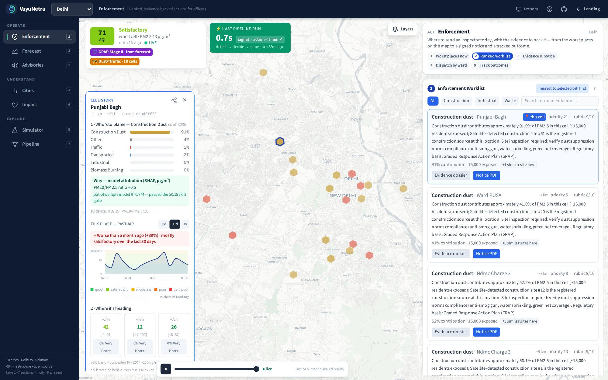
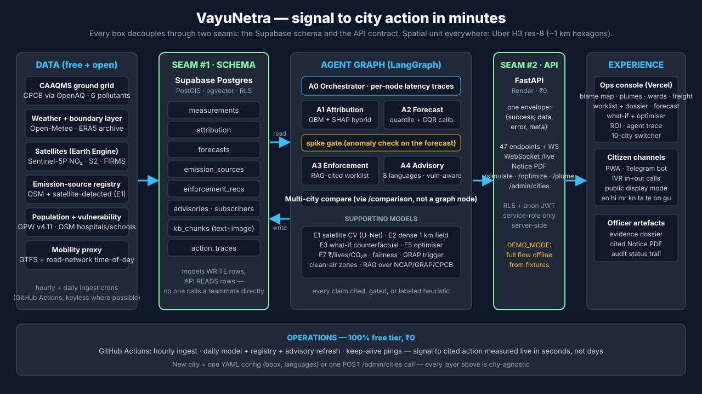

# VayuNetra — AI-Powered Urban Air Quality Intelligence

> *We don't just measure the air. We trace it, predict it, and act on it.*
> ET AI Hackathon 2026 · Problem Statement 5 · **10 Indian cities** · **₹0 infrastructure**

India measures its air (900+ CAAQMS stations) and forecasts it, but almost no city can turn a bad
reading into a specific, attributed, delivered intervention. **VayuNetra is that missing operate
layer**: a six-agent AI platform that fuses ground sensors, Sentinel satellite data, weather,
mobility and land use into one loop — *who is to blame for PM2.5 in each ~1 km² cell, what the air
will be in 72 hours, which enforcement action to take, and how to warn the people breathing it.*



## Live demo

| | |
|---|---|
| **App** | https://vayunetra-aqi.vercel.app |
| **API** | https://vayunetra-c8i8.onrender.com/health |
| **Telegram** | `@aqivayu_bot` — `/start`, pick a city, receive live advisories |

**Try it in 60 seconds:** open the console → click any hexagon (its *Cell Story*: blame →
evidence → 72 h forecast) → **Enforcement** → *Evidence dossier* (Sentinel-2 patch + RAG
citations) → *Notice PDF* (draft notice with a projected-impact chart) → **Advisories** →
switch the language to Hindi → *IVR call* tab.

## What it does

1. **Trace** — GBM + SHAP source attribution per ~1 km² H3 cell (traffic, construction dust,
   industrial, biomass burning, transported), with confidence scores — and it **abstains** to
   cited chemical-signature priors wherever the model lacks out-of-sample skill.
2. **Predict** — 24/48/72 h PM2.5 forecasts per cell with CQR-calibrated 80% uncertainty bands
   and an honest persistence baseline on every chart.
3. **Act** — a ranked, evidence-backed enforcement worklist: satellite patch + RAG-retrieved
   regulatory citations + one-click draft Notice PDF. Officer-in-the-loop; dispatching arms
   automatic before/after impact tracking.
4. **Protect** — citizen advisories in **eight languages** (Hindi, Kannada, Marathi, Tamil, Telugu,
   Bengali, Gujarati, English) over the app, a live Telegram bot, a working IVR demo line and public displays — targeted by 5,495
   vulnerability-scored zones (hospitals, schools, outdoor workers × real population).

Plus a Swachh-Vayu-style **10-city ranking**, a cited what-if **simulator** with an inspector-hour
optimizer, a health-₹ **impact** view with attribution-weighted NCAP fund guidance and a fairness
audit, a **citizen complaint loop** (photo → verified → enforcement candidate, public SLA clock),
PRANA-ready **NCAP evidence export**, a live **pipeline** trace of all six agents (typical
signal→cited-recommendation: **0.8–9.7 s** compute, measured; the officer's review and the field dispatch are tracked separately), and map layers for wind plumes, wards, freight
corridors and FIRMS fire events.

**Production snapshot (18 August 2026; the landing page reads these live):** **10 cities** (Delhi · Bengaluru ·
Mumbai · Hyderabad · Chennai · Kolkata · Pune · Ahmedabad · Jaipur · Lucknow) · 16,529 modeled ~1 km² cells ·
647 registered + satellite-detected emission sources · 5,495 vulnerability zones · ~480 RAG-cited enforcement
recommendations · 451K unique readings live (one row per reading, older months archived) · advisories in
8 languages (city-specific scripts).

## Validation — real numbers, both baselines

Strict temporal-split benchmark on real CPCB station data — multi-season (2025-26 winter + summer
2026), monthly refit on the trailing 90 days exactly as production trains, one shared support
mask, persistence / weekly seasonal-naive / climatology baselines. Regenerate with
`python -m ml.eval.benchmark` ([docs/BENCHMARKS.md](docs/BENCHMARKS.md)); the API serves the
artifacts (`GET /metrics/benchmark`) and the console prints them.

| City (test station-hours) | served-forecast skill vs persistence (24/48/72 h) | winter only | Very-Poor onsets flagged, alarm on P ≥ 0.3 (persistence = 0) |
|---|---|---|---|
| Delhi (207k) | **+9% / +13% / +12%** | +7% / +11% / +11% | **54% / 54% / 51%** |
| Mumbai (142k) | **+17% / +19% / +21%** | +15% / +17% / +20% | few Very-Poor hours |
| Kolkata (59k) | +14% / +10% / +9% | +12% / +13% / +8% | 19% / 18% / 6% |

**Real orders, in hindsight** ([docs/OUTCOMES.md](docs/OUTCOMES.md)): the winter 2025-26 CAQM GRAP
escalations replayed against the served forecast — Stage III (11 Nov) and Stage IV (13 Dec) were flagged
a day ahead across 99–100 % of Delhi's station cells (P(>120) 0.83–0.94); the two October orders were
not foreseen, and we say so. A weather-normalised check finds no reduction the method can detect during
the GRAP windows (Diwali night, the positive control, shows +182 µg/m³) — association only, blind spots
stated. `python -m ml.eval.interventions` · `GET /metrics/interventions`.

The served forecast is the LightGBM median blended with persistence (weight chosen on the calibration
tail; the raw model alone is +2 / +10 / +9% in Delhi — both columns are in the artifact).
80% interval → 78% measured coverage; calibrated P(>120) on every forecast (Brier skill +51% vs
climatology at 24 h). Live 90-day benchmarks exist for all 10 cities.

*skill = 1 − RMSE_model / RMSE_baseline. Negative numbers are kept — the Delhi 24 h and Severe-tail weak spots ship too.*

**Attribution cross-checked against published apportionment** (`docs/ATTRIBUTION_VALIDATION.md`,
`evaluate.ipynb §10`): cosine similarity **0.88 vs SAFAR-Delhi (2018)** · **0.90 vs CSTEP-Bengaluru
(2022, verified against the primary report)** · 0.93 vs NEERI/Urban-Emissions Mumbai (run of
18 Aug 2026) — and, bucket by bucket, against TERI-ARAI 2018 (Delhi) and Guttikunda et al. 2019
(Bengaluru), agreements and disagreements both stated (biomass ≈ 0 in monsoon is seasonally
correct; kerbside traffic over-read; small waste fires invisible to FIRMS). What-if intervention magnitudes are
literature-grounded (Delhi odd-even trials, CAQM GRAP schedules); every `/simulate` figure
carries its citation.

**Honest by construction:** the attribution abstains below its R² skill gate; forecast intervals
were audited, found under-covered, and fixed with CQR; a deep-learning forecaster (TFT) was
trained on GPU and *rejected* because LightGBM won held-out skill in every launch city; satellite
source detection is a labelled Earth-Engine heuristic (NDVI drop → construction,
FIRMS thermal → waste burning), stated as such on every site — a learned CV detector is roadmap, not
claimed — nothing fabricated ever reaches production, and impact figures return `null` over invented constants.

## Architecture



Everything decouples through **two seams**: the Supabase schema (models **write** rows, the API
**reads** rows) and the API contract (one `{success, data, error, meta}` envelope). The spatial
unit everywhere is an **Uber H3 res-8 cell (~1 km²)**. Six LangGraph agents run the loop —
orchestrator → attribution → forecast → *spike gate* → enforcement → advisory, plus a multi-city
comparator — each run traced per node. Full detail: [docs/ARCHITECTURE.md](docs/ARCHITECTURE.md).

**Stack:** FastAPI (Render) · React + MapLibre + Deck.gl (Vercel) · Supabase Postgres + PostGIS +
pgvector (RLS) · LangGraph · GitHub Actions crons — all free tier for the ten cities running today; the
measured cost curve to all 131 NCAP cities (~₹2,700/month) is in `docs/SCALE.md`. **Adding a city is one YAML
file** in [core/config/cities/](core/config/cities/) (bbox, languages, regulatory authority) plus
one backfill run — every layer is city-agnostic; seven metros were onboarded that way in one week.

## Quick start

```bash
# Offline-first — the full flow runs from bundled fixtures, zero keys needed
cp .env.example .env                   # keep DEMO_MODE=true
make install                           # Python venv + web deps (CPU-only, lean)
make dev                               # FastAPI :8000 + Vite :5173 in one terminal

# Going live (optional): fill .env, then
npx supabase login && npx supabase link --project-ref <your-project-ref>
npx supabase db push                   # schema + RLS + city seed (20 migrations)
make live-bootstrap                    # kb_chunks + enforcement_recs + action_traces

make test                              # 204 backend tests (64% line coverage, CI gate 55%)
cd web && npx playwright test          # 7 e2e smoke + 9 live journey flows (VN_LIVE=1)
```

## Repo layout

```
connectors/   ingest: CPCB/OpenAQ, Open-Meteo, Earth Engine, OSM, population, traffic
core/         H3 utils, canonical schemas, impact & intervention math, city configs
ml/           attribution, forecast, dispersion, coverage, simulator, vision
agents/       the 6 LangGraph agents + the notice-PDF writer      rag/  retrieval corpus
api/          FastAPI (44 routes + WebSocket)                     web/  React console + landing
demo/         19 offline fixtures    supabase/migrations/  schema+RLS    eval/  validation notebook
```

## Documentation

| | |
|---|---|
| [docs/USER_GUIDE.md](docs/USER_GUIDE.md) · [PDF](docs/USER_GUIDE.pdf) | Every screen, control and option — the source of truth |
| [docs/ARCHITECTURE.md](docs/ARCHITECTURE.md) | The buildable blueprint (two seams, agents, data) |
| [docs/API_CONTRACT.md](docs/API_CONTRACT.md) | The API envelope and endpoints |
| [docs/AI_METHODOLOGY.md](docs/AI_METHODOLOGY.md) | Models, validation, fairness and guardrails |
| [docs/PRD.md](docs/PRD.md) | Product requirements |
| [docs/VayuNetra_Pitch.html](docs/VayuNetra_Pitch.html) | Finale deck — self-contained, animated (India/Delhi maps, live-data charts, embedded live console); `docs/PITCH_SCRIPT.md` has the 7½-minute script |
| [docs/VayuNetra_Pitch.pptx](docs/VayuNetra_Pitch.pptx) · [.pdf](docs/VayuNetra_Pitch.pdf) | Static export of the same slides with speaker notes (backup) |
| [docs/DEMO_VIDEO_SCRIPT.md](docs/DEMO_VIDEO_SCRIPT.md) · [PDF](docs/DEMO_VIDEO_SCRIPT.pdf) | The 3-minute demo, beat by beat |
| [docs/EXPERT_RATING_SHEET.md](docs/EXPERT_RATING_SHEET.md) · [DOCX](docs/EXPERT_RATING_SHEET.docx) | Independent domain-expert review form |

## Team

**Omkar Kadam · Sejal Kumbhar · Abhinav Prasad** — Full-Stack AI Engineers.

Three engineers, one shared codebase — each worked across the whole stack: the ML models, the
agent graph & API, and the app & citizen channels.

## Where we sit in India's air-quality stack

CPCB/CAAQMS **measures** · SAFAR **forecasts** · **VayuNetra operates** — blame this cell now,
forecast 72 h, generate a cited notice, call the citizen — in minutes ·
[PAVITRA](https://pavitra.org)/InMAP **plans policy** on annual timescales. Integrating their
source–receptor matrices under our what-if engine is the roadmap: their science is our upgrade
path, not our competitor.
