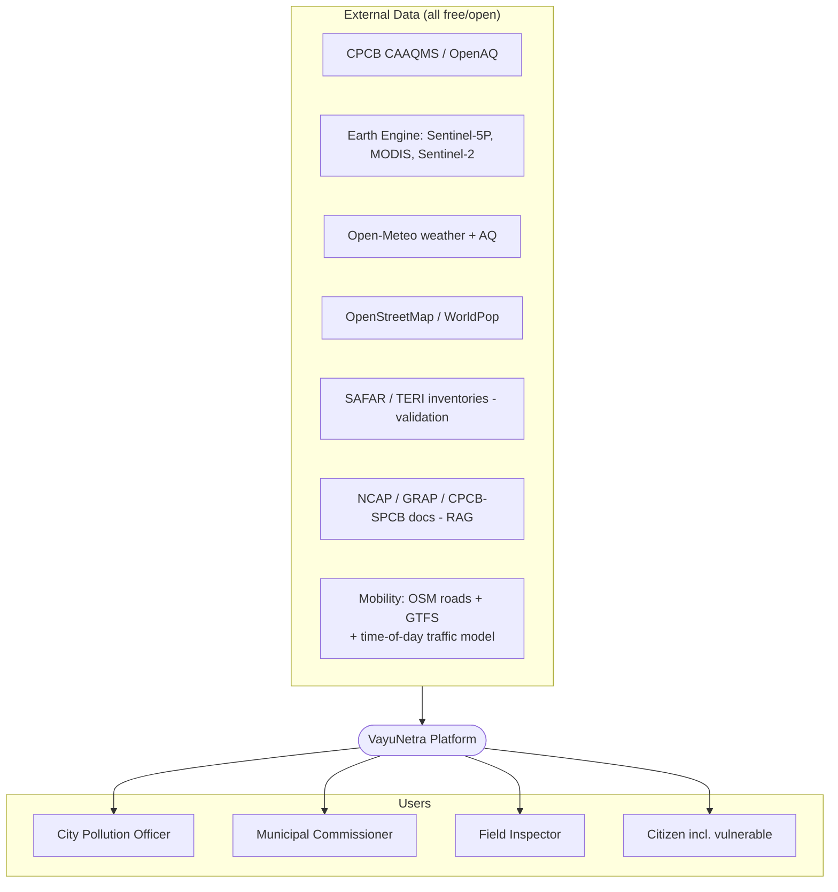
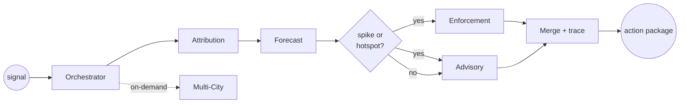
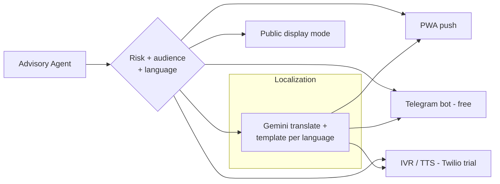
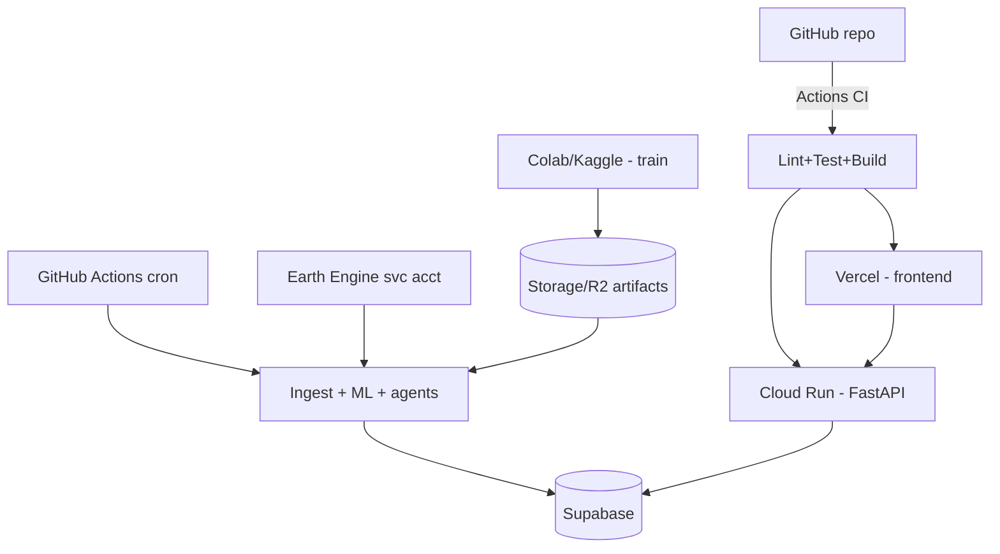
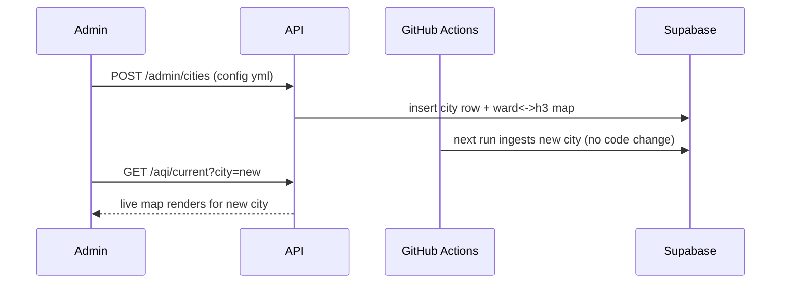
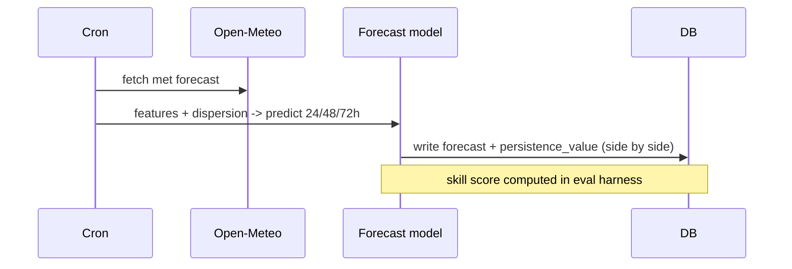

# VayuNetra — Technical Architecture Specification

> Companion to **[PRD.md](PRD.md)**. This document is the **buildable blueprint** for a 2–3 person team. It specifies components, data models, agent contracts, APIs, the ML/RAG subsystems, deployment, and — critically — a **100% free-tier ($0) implementation** path.
>
> **Project:** VayuNetra · **Problem Statement:** PS5 — AI-Powered Urban Air Quality Intelligence · **Hackathon:** ET AI Hackathon 2026 · **Spec version:** v1.4 (synced to PRD)

---

## Table of Contents
1. [Purpose & Architectural Constraints](#1-purpose--architectural-constraints)
2. [Guiding Principles](#2-guiding-principles)
3. [System Context (C4 L1)](#3-system-context-c4-l1)
4. [Container / Component View (C4 L2)](#4-container--component-view-c4-l2)
5. [The Free-First Technology Stack ($0)](#5-the-free-first-technology-stack-0)
6. [Spatial Data Model (H3)](#6-spatial-data-model-h3)
7. [Data Architecture](#7-data-architecture)
8. [Multi-Agent Intelligence Layer (LangGraph)](#8-multi-agent-intelligence-layer-langgraph)
9. [ML Subsystem](#9-ml-subsystem)
10. [RAG Subsystem](#10-rag-subsystem)
11. [API Design](#11-api-design)
12. [Frontend Architecture](#12-frontend-architecture)
13. [Citizen Channel Architecture](#13-citizen-channel-architecture)
14. [Validation & Evaluation Harness](#14-validation--evaluation-harness)
15. [Deployment Topology & CI/CD](#15-deployment-topology--cicd)
16. [Security, Auth & Roles](#16-security-auth--roles)
17. [Observability & Signal-to-Action Instrumentation](#17-observability--signal-to-action-instrumentation)
18. [Scalability & Multi-City Mechanics](#18-scalability--multi-city-mechanics)
19. [Non-Functional Requirements](#19-non-functional-requirements)
20. [Repository Structure](#20-repository-structure)
21. [Key Sequence Flows](#21-key-sequence-flows)
22. [Free-Tier Limits & Mitigations](#22-free-tier-limits--mitigations)
23. [Build Order (maps to PRD phases)](#23-build-order-maps-to-prd-phases)
24. [Open Technical Decisions](#24-open-technical-decisions)

---

## 1. Purpose & Architectural Constraints

This spec turns the PRD into something the team can build against tomorrow.

**Hard constraints (from team decisions):**
| Constraint | Implication |
|---|---|
| **$0 / free-tier only** | Every component must have a genuine free tier; no paid infra. Documented limits + mitigations. |
| **City-agnostic, multi-city from day one** | Universal spatial key (H3) + config-driven city onboarding; **no per-city code**. |
| **Live: 10 cities** — Delhi, Bengaluru, Mumbai (launch) + Hyderabad, Chennai, Kolkata, Pune, Ahmedabad, Jaipur, Lucknow (Aug 2026, config-onboarded) | Languages: **Hindi, English, Kannada, Marathi** — new cities launch en/hi (Pune: mr) until native-speaker-reviewed templates exist for te/ta/bn/gu. |
| **No domain expert** | Enforcement quality validated by a transparent **CPCB/GRAP-derived rubric proxy**, not claimed expert review. |
| **2–3 person team, time not constrained** | Favor managed free services over self-hosting; minimize ops burden. |
| **Multi-agent + geospatial + RAG** | The architecture must visibly embody all three (the organizers' signal). |

**Bonus the $0 constraint buys us:** "VayuNetra runs entirely on free and open infrastructure — any of India's 131 NCAP cities can adopt it at near-zero cost." This is a pitch asset (Scalability + Business Impact).

---

## 2. Guiding Principles
1. **Action over measurement** — every component exists to produce an *action* (attribution → forecast → enforcement → advisory), never just a number.
2. **City-agnostic by construction** — all data normalizes to `(city_id, h3_cell, ts, variable, value, source, confidence)`.
3. **Physics + ML hybrid** — dispersion + chemical priors keep ML explainable and legally defensible.
4. **Everything is cited & traced** — attribution confidence, RAG citations, agent traces. Judges trust what they can audit.
5. **Free, but not fragile** — cache aggressively, degrade gracefully, never let a flaky live API break the demo.
6. **Model-agnostic LLM** — swap Gemini/Groq/Ollama via config; if the hackathon grants LLM credits, switch with one env var.

---

## 3. System Context (C4 L1)



---

## 4. Container / Component View (C4 L2)

```mermaid
flowchart LR
    subgraph EDGE["Ingestion (GitHub Actions cron - free)"]
        I1[Connectors:<br/>CAAQMS/OpenAQ/Meteo/OSM]
        I2[EE jobs:<br/>satellite features]
        I3[Normalizer -><br/>H3 canonical schema]
    end

    subgraph STORE["Data Platform (Supabase free)"]
        S1[(Postgres + PostGIS)]
        S2[(pgvector: RAG)]
        S3[(Storage: rasters/tiles)]
    end

    subgraph BRAIN["Intelligence (LangGraph)"]
        O[Orchestrator]
        A1[Attribution]
        A2[Forecast]
        A3[Enforcement]
        A4[Advisory]
        A5[Multi-City]
    end

    subgraph SERVE["API (FastAPI on Cloud Run free)"]
        P1[REST + WebSocket]
        P2[Auth - Supabase]
    end

    subgraph FRONT["Clients"]
        F1[Authority Console<br/>React+MapLibre+Deck.gl - Vercel]
        F2[Citizen PWA]
        F3[Telegram bot / IVR-opt]
    end

    subgraph ML["ML/Batch (Colab/Kaggle free)"]
        M1[Attribution model]
        M2[Forecast model]
        M3[Dispersion engine]
        M4[Satellite CV - E1]
        M5[Dense-coverage - E2]
    end

    EDGE --> STORE
    STORE --> BRAIN
    ML --> STORE
    BRAIN --> SERVE
    SERVE --> FRONT
    BRAIN -.uses.-> ML
```



---

## 5. The Free-First Technology Stack ($0)

| Layer | Choice | Free tier / why | Limit & mitigation |
|---|---|---|---|
| **Satellite / RS** | **Google Earth Engine** | Free for research/non-commercial (hackathon qualifies); Google runs the compute | Quotas → precompute city features nightly, cache in Storage. Backup: **MS Planetary Computer** (free) |
| **Weather + AQ forecast feed** | **Open-Meteo** | Free, **no API key**, includes forecast + Air-Quality API | Rate limits generous; cache hourly |
| **Ground AQI** | **CPCB (data.gov.in)** + **OpenAQ** | Free API key / free API | CPCB flaky → OpenAQ + historical backfill |
| **Mobility feeds** (PS5-named) | OSM roads + **GTFS** transit + time-of-day traffic model | Free | real-time traffic is paid → engineered proxy (known limitation, §24) |
| **Database** | **Supabase** (Postgres 15) | Free: **PostGIS + pgvector + Auth + Realtime**, 500 MB DB, 1 GB storage | 500 MB → store recent+aggregated; archive rasters to Storage/R2 |
| **Object storage** | Supabase Storage / **Cloudflare R2** free | Rasters, tiles, model artifacts | R2 10 GB free egress-free |
| **Vector store (RAG)** | **pgvector** on Supabase | No extra service | Small corpus; fine on free tier |
| **Agent framework** | **LangGraph** (OSS) | Free, stateful multi-agent, traceable | — |
| **LLM (reasoning/RAG/i18n)** | **Google Gemini API free tier** (Flash) | Free, strong **multilingual**, good reasoning | Rate limits → cache + batch. Fallbacks: **Groq** (free Llama 3.3), **Ollama** (local) |
| **Embeddings** | **Default: local `bge-small`** via sentence-transformers (zero-API, no rate limits); Gemini text-embedding optional | Free | Local default avoids API throttling |
| **ML training** | **Google Colab** (free T4) + **Kaggle** (30h/wk GPU) | Free GPU for forecast/attribution models | Session limits → checkpoint to Storage |
| **ML libs** | LightGBM/XGBoost (MVP), PyTorch + torchvision / segmentation-models-pytorch (satellite CV, GNN/TFT), scikit-learn | OSS | — |
| **Dispersion** | Custom **Gaussian plume** (Python) + **HYSPLIT** (NOAA, free) | OSS/free | Simplify to plume + wind advection if time-boxed |
| **Backend / API** | **FastAPI** on **Google Cloud Run** free tier (2M req/mo, scale-to-zero) | Free, persistent URL | Cold starts → min-instance off; warm before demo. Alt: **Render**/**HF Spaces** |
| **Pipelines / scheduler** | **GitHub Actions** cron (2000 min/mo free) | Free scheduled data refresh + forecast runs | Keep jobs < keep within minutes; stagger |
| **Frontend hosting** | **Vercel** / **Netlify** free | Free CDN + CI | — |
| **Maps** | **MapLibre GL** + **Deck.gl** (`H3HexagonLayer`) + **Protomaps/MapTiler free** basemap | Fully free (no Mapbox token) | MapTiler free key or self-host Protomaps PMTiles |
| **Citizen channels** | **Telegram Bot API** (100% free) + **PWA**; **Twilio trial** for IVR demo | Telegram free forever; Twilio trial credit for a callable number | WhatsApp Business has cost → Telegram primary, WhatsApp "production upgrade" |
| **Auth** | **Supabase Auth** | Free, role-based | — |
| **Observability** | Structured logs + in-app latency widget; **Grafana Cloud** free (optional) | Free | — |
| **CI/CD + Repo** | **GitHub** + Actions | Free | — |

> **Net infra cost target: ₹0.** Document any component that risks crossing a free limit in §22.

> **Model/cloud-agnostic:** the PRD stack rows are synced to this free-first design. The LLM and cloud are swappable via config — if the hackathon later grants Claude or GCP/AWS credits, switching is a one-env-var change with zero architectural impact.

---

## 6. Spatial Data Model (H3)

- **Universal spatial key = Uber H3.** Primary resolution **res 8** (avg hexagon ≈ **0.74 km²**, edge ≈ 0.46 km) → satisfies the brief's "~1 km grid."
- **Hierarchy:** res 6 (city zones) ⊃ res 8 (hyperlocal cells) ⊃ res 9 (fine, optional). Ward boundaries mapped to covering H3 sets.
- **Why H3:** (1) one math for every city (city-agnostic), (2) clean spatial joins across sensors/satellite/population/sources, (3) native Deck.gl `H3HexagonLayer` rendering, (4) cheap aggregation up/down resolutions.
- **Ward ↔ H3 mapping table** lets us present results at administrative ward level (officer-friendly) while computing on H3 (uniform).

---

## 7. Data Architecture

### 7.1 Connectors → normalization
Each external source has a connector that maps raw payloads to the **canonical measurement** record. Connectors are city-agnostic; a city is just a config (bbox, CAAQMS station ids, ward GeoJSON, language set).

**Connectors:** CAAQMS · OpenAQ · Open-Meteo · Earth Engine (satellite) · OSM · **GTFS / mobility** · **WorldPop / population-vulnerability** · SAFAR/TERI (validation) · NCAP/GRAP docs (RAG).

### 7.2 Canonical schemas (Postgres + PostGIS on Supabase)

```sql
-- Cities = config-driven onboarding (NO per-city code)
cities(
  city_id text primary key, name text, state text,
  bbox geometry(Polygon,4326), center geometry(Point,4326),
  languages text[],            -- e.g. {hi,en,kn,mr}
  caaqms_station_ids text[], ward_geojson_ref text,
  active boolean default true
);

-- Universal measurements (ground + satellite + weather, all here)
measurements(
  id bigserial primary key, city_id text, h3_cell text,         -- res 8
  station_id text null, ts timestamptz,
  variable text,               -- pm25,pm10,no2,so2,co,o3,aod,fire,wind_u,wind_v,blh,...
  value double precision, unit text,
  source text,                 -- caaqms,openaq,s5p,modis,s2,openmeteo
  confidence double precision default 1.0, ingested_at timestamptz default now()
);
create index on measurements(city_id, variable, ts);
create index on measurements(h3_cell, ts);

-- Source attribution (Agent 1 output) — the "blame map"
attribution(
  city_id text, h3_cell text, ts_window tstzrange,
  source_category text,        -- traffic,construction_dust,industrial,biomass_burning,transported,other
  share double precision,      -- 0..1, sums to 1 per cell/window
  confidence double precision, method_version text,
  evidence jsonb               -- which signals drove it (for explainability)
);

-- Forecasts (Agent 2 output) — incl. baseline for honest comparison
forecasts(
  city_id text, h3_cell text, issued_at timestamptz,
  horizon_h int,               -- 24,48,72
  target_var text default 'aqi',
  value double precision, pi_low double precision, pi_high double precision,
  persistence_value double precision,    -- baseline shown side-by-side
  model_version text
);

-- Emission source registry (Agent 3 inputs; CV-detected sources from E1 land here too)
emission_sources(
  id bigserial primary key, city_id text, geom geometry(Geometry,4326),
  type text,                   -- industry,construction,waste_burn,diesel_corridor
  name text, registry_ref text,
  source_origin text default 'registry',   -- registry | cv_detected (E1)
  detection_confidence double precision,    -- for CV-detected sources
  attributes jsonb
);

-- Enforcement recommendations (Agent 3 output)
enforcement_recs(
  id bigserial primary key, city_id text, h3_cell text, ts timestamptz,
  source_id bigint null, priority_score double precision,
  contribution double precision, pop_exposed int,
  rationale text, evidence jsonb, rag_citations jsonb,
  rubric_score jsonb,          -- §14 proxy score
  status text default 'proposed'
);

-- Citizen advisories (Agent 4 output)
advisories(
  id bigserial primary key, city_id text, ward_id text, h3_cell text,
  issued_at timestamptz, horizon_h int, risk_tier text,
  audience_segment text,       -- general,outdoor_worker,elderly,school,respiratory
  language text, channel text, message text
);

-- RAG knowledge base (pgvector) — text + (E6) multimodal satellite image-patch embeddings
kb_chunks(
  id bigserial primary key, doc_id text, title text, source_url text,
  modality text default 'text',     -- text | image (E6 Sentinel-2 patch)
  chunk_text text, image_ref text,  -- image_ref -> Storage/R2 patch when modality='image'
  embedding vector(768), metadata jsonb
);
create index on kb_chunks using ivfflat (embedding vector_cosine_ops);

-- Latency telemetry (proves North-Star metric)
action_traces(
  id bigserial primary key, city_id text, signal_ts timestamptz,
  attribution_ts timestamptz, forecast_ts timestamptz,
  enforcement_ts timestamptz, advisory_ts timestamptz,
  total_latency_ms int, trace jsonb
);
```

### 7.3 Storage tiers (free-tier sizing)
- **Hot (Postgres):** recent measurements (e.g., 30–90 days), latest attribution/forecast, registries, RAG. Keep < 500 MB by retaining recent + aggregated only.
- **Warm/Cold (Storage/R2):** raster tiles, satellite-derived feature grids, historical archives, model artifacts.
- **Aggregation job:** nightly roll-up of old fine-grain rows → daily/ward summaries; purge raw beyond retention.

### 7.4 Refresh pipelines (GitHub Actions cron — free)
| Job | Schedule | Output |
|---|---|---|
| `ingest_ground` | hourly | CAAQMS/OpenAQ → measurements |
| `ingest_weather` | hourly | Open-Meteo forecast + AQ → measurements |
| `ee_satellite_features` | daily | Earth Engine → city feature grids → Storage + measurements |
| `run_attribution` | hourly | Agent 1 → attribution table |
| `run_forecast` | 6-hourly | Agent 2 → forecasts (+ persistence) |
| `refresh_enforcement` | 6-hourly | Agent 3 → enforcement_recs |
| `rollup_archive` | nightly | aggregate + purge to stay in free limits |

---

## 8. Multi-Agent Intelligence Layer (LangGraph)

### 8.1 Shared state (typed)
```python
class GraphState(TypedDict):
    city_id: str
    time_window: tuple           # (start, end)
    focus_cells: list[str]       # H3 cells of interest (e.g., spiking)
    signals: dict                # latest measurements snapshot
    attribution: dict            # Agent 1 result
    forecast: dict               # Agent 2 result
    enforcement: list            # Agent 3 result
    advisories: list             # Agent 4 result
    comparison: dict             # Agent 5 result
    citations: list              # RAG sources used
    trace: list                  # per-node timing + decisions
    latency_ms: int
```

### 8.2 Graph topology


### 8.3 Agent contracts

| Agent | Input | Output | Tools | LLM use |
|---|---|---|---|---|
| **Orchestrator** | trigger (signal/query/schedule) | routed plan + merged action package | state mgr, router | Light — routing/explanation only |
| **A1 Attribution** | measurements + satellite + land use (focus cells) | `attribution[]` + confidence + evidence | ML model svc, dispersion svc, SQL | Optional — narrate evidence |
| **A2 Forecast** | met forecast + lags + dispersion + calendars | `forecasts[]` + intervals + persistence | ML model svc, Open-Meteo | None (pure ML) |
| **A3 Enforcement** | attribution + forecast + source registry + exposure | ranked `enforcement_recs[]` + dossiers | RAG, SQL, scorer | Yes — dossier synthesis w/ citations |
| **A4 Advisory** | forecast + vulnerability + health breakpoints | `advisories[]` multi-language | RAG (health), i18n, channels | Yes — localization/translation |
| **A5 Multi-City** | cross-city history + interventions | comparison + playbook recs | SQL, analytics | Yes — narrative synthesis |

**Design rule:** ML/physics produce the *numbers*; the LLM only *explains, cites, localizes, and synthesizes*. This keeps outputs accurate and auditable (no hallucinated AQI).

---

## 9. ML Subsystem

### 9.1 Attribution model (Agent 1)
- **Approach:** physics-informed features + supervised apportionment.
- **Features per H3 cell/time:** pollutant ratios (PM10:PM2.5, NO₂, SO₂, CO, O₃), satellite NO₂ column, AOD, fire-pixel proximity, land-use fractions (industrial/road/built), traffic proxy, wind-advected upwind signals, dispersion output.
- **Model:** gradient boosting (multi-output) → source-share vector; calibrated; **SHAP** for explainability ("why this blame").
- **Labels/calibration:** anchor to published SAFAR/TERI apportionment for validation wards (held out, never trained on).

### 9.2 Forecast model (Agent 2)
- **Target:** AQI / PM2.5 per H3 cell at +24/+48/+72h.
- **Features:** met forecasts (wind u/v, BLH, temp, RH, precip from Open-Meteo), lagged AQI, dispersion prior, traffic + **seasonal/event calendars** (stubble windows, Diwali, winter inversion), spatial neighbors, hour/day-of-week.
- **Models:** **MVP = LightGBM** w/ quantile loss (intervals). **Finale = spatiotemporal GNN / Temporal Fusion Transformer** (PyTorch, trained on Colab/Kaggle).
- **Baselines (mandatory):** **persistence** (`ŷ(t+h)=y(t)`) + climatology. Stored alongside every forecast for side-by-side proof.
- **Serving:** batch (GitHub Actions) writes `forecasts`; API reads. Lightweight model can also run in-API for live "what-if."
- **Physics-informed:** the dispersion output (§9.3) enters as a feature/constraint → a genuine **physics-informed ML hybrid** (explainable + atmospheric-science-grounded), the "novel ML" depth judges want without black-box risk. *Optional stretch (not committed):* full **PINN** (advection-diffusion in the loss) — high upside, high risk; core-first only.

### 9.3 Dispersion engine (physics prior)
- **Gaussian plume** for local point/area sources (industry/construction) + **wind-field advection** of satellite NO₂/AOD for transported pollution; optional **HYSPLIT** back-trajectories.
- Feeds attribution (transported share) and forecast (physics feature). Pure Python; runs in batch.

### 9.4 Model ops (free)
- Versioned artifacts in Storage/R2; metadata in Postgres; experiment tracking via lightweight logs or **MLflow** (local/HF). No paid registry.

### 9.5 Satellite source-detection CV — E1 (trained)
- **Model:** semantic segmentation / detection (U-Net or Mask R-CNN with a pretrained encoder) on **Sentinel-2** (10 m bands) + optional **Sentinel-1 SAR** for cloud robustness; classes = construction, brick kiln, open burning.
- **Labels:** bootstrap from OSM land use + known sites + a small hand-labelled tile set; transfer-learning keeps the labelled set small.
- **Output:** geo-located detections → `emission_sources` (auto-populates enforcement). Trained on Kaggle GPU; inferred in the daily EE job.

### 9.6 Dense-coverage models — E2 (trained)
- **AOD→PM2.5:** GBM/MLP regressor on paired satellite AOD + met → surface PM2.5; fills no-station areas.
- **1km downscaling:** lightweight CNN / learned super-resolution fusing station + satellite + land use → dense H3-res-8 field + uncertainty. Turns ~40 stations into a full-city 1 km map.

### 9.7 Intervention what-if simulator — E3
- **Engine:** counterfactual dispersion + forecast run with a source toggled off/reduced → ΔAQI per H3 cell; served via `POST /simulate`; powers the prescriptive demo. Reuses §9.2 + §9.3 (no new model to train).
- **Impact quantification:** ΔAQI × WorldPop population × exposure-response → **people protected + PM2.5 tonnes avoided + exposure-hours reduced** per scenario (returned by `/simulate`; the Business-Impact numbers on the demo card).

### 9.8 Spike / anomaly detector — E4 (trained, stretch)
- **Model:** STL decomposition + isolation forest / autoencoder over per-cell series; flags novel events → enforcement queue.

### 9.9 Training plan & compute (free)
- **Where:** Google Colab (free T4) + Kaggle (30 h/wk GPU). **Tracking:** MLflow-lite + metrics in Postgres. **Artifacts:** versioned to R2/Storage. **Reproducibility:** one `evaluate.ipynb` regenerates every metric (no leakage, fixed seeds, SAFAR/TERI held out).
- **Serving:** batch inference in GitHub Actions writes results to Supabase; light models run in-API for live what-if.

### 9.10 Responsible AI & fairness
- **Equity guard:** enforcement prioritisation is monitored so it does **not** systematically over-target low-income wards; **human approval** is required before any action.
- **Privacy:** citizen advisory uses **ward-level**, not individual, location by default. Every model output carries a confidence score.

### 9.11 Prescriptive optimiser — E5
- **Engine:** greedy / priority-knapsack over candidate interventions (construction halts, corridor diversions, CV-detected-site inspections); each scored via the E3 simulator by exposure-weighted ΔAQI ÷ resource cost, under an inspector-hour / budget constraint. Returns top-3 ranked packages. Served via `POST /optimize`. **No training** — search over existing simulators.

### 9.12 Multimodal RAG — satellite visual evidence — E6
- **Engine:** a free **CLIP** / vision encoder embeds Sentinel-2 patches → pgvector (`kb_chunks.modality='image'`, `image_ref` → Storage/R2). The enforcement dossier retrieves the most relevant patch **+** governing rule, citing both. Pretrained encoder; **no custom training**.

### 9.13 Health & carbon quantification — E7
- **Engine:** static, **citable** factor tables — WHO/CPCB dose-response (ΔPM2.5 → cases / mortality risk → ₹ health cost) + emission factors (→ CO₂e). Applied across attribution / forecast / what-if / optimiser; **every figure cites its source**. Feeds `/simulate`, `/optimize`, and advisory cards.

---

## 10. RAG Subsystem

- **Corpus:** NCAP, **GRAP** action matrices, CPCB/SPCB regulations & consent norms, CPCB/WHO AQI **health breakpoints**, source-apportionment literature, enforcement SOPs.
- **Ingestion:** PDF/HTML → clean text → semantic chunking → embeddings (**default local `bge-small`**, Gemini optional) → `kb_chunks` (pgvector).
- **Retrieval:** cosine top-k + metadata filters (city/topic) → LLM synthesizes **cited** answers (every claim links to a source chunk).
- **Used by:** A3 (regulatory basis for enforcement dossiers) and A4 (health-threshold grounding for advisories).
- **Why it matters:** citations make enforcement **court-defensible** and make judges trust the system.
- **Multimodal (E6):** Sentinel-2 image patches are CLIP-embedded into the same pgvector store (`modality='image'`); enforcement dossiers retrieve and **cite the visual evidence** alongside the governing rule — the officer sees the satellite proof, not just text.

---

## 11. API Design

**FastAPI** (async) on Cloud Run free tier. Auth via Supabase JWT; role-gated.

| Method | Endpoint | Purpose | Role |
|---|---|---|---|
| GET | `/cities` | list onboarded cities | all |
| GET | `/aqi/current?city&bbox` | live AQI per H3 | all |
| GET | `/attribution?city&cell|ward&ts` | source split + confidence | officer+ |
| GET | `/forecast?city&cell&horizon` | forecast + intervals + persistence | all |
| GET | `/enforcement?city&date` | ranked recommendations | officer+ |
| POST | `/enforcement/{id}/dossier` | generate cited evidence packet + **satellite visual evidence** (E6) | officer+ |
| GET | `/advisory?city&ward&lang` | localized citizen advisory | all |
| POST | `/agent/query` | conversational orchestrator (NL → action) | officer+ |
| POST | `/simulate` | what-if intervention → ΔAQI + people protected / PM2.5 avoided + ₹/CO₂e (E3, E7) | officer+ |
| POST | `/optimize` | best intervention bundle under a resource/inspector budget → top-3 packages (E5) | officer+ |
| POST | `/admin/cities` | **onboard a city via config** (scalability demo) | admin |
| WS | `/live` | push attribution/forecast/alert updates | all |

**Envelope (per global API standard):** `{ success, data, error, meta }`.

---

## 12. Frontend Architecture

**Authority Console** — React + TypeScript + Vite + Tailwind + **MapLibre GL** + **Deck.gl** (Vercel).
- **Map-first** layout; default = **Blame Map** (`H3HexagonLayer` colored by *dominant source*, not just AQI).
- **Layer panel:** live AQI · source attribution · 24–72h forecast (time-slider) · enforcement targets · population vulnerability · satellite overlays.
- **Key demo toggles:** **"Detected Sources"** (E1 satellite-CV construction/kiln/burn) · **"Stations-only ↔ Dense 1km grid"** (E2) · **"What-if intervention"** (E3, calls `POST /simulate`) · **SHAP tooltips** on the blame map (*"NO₂ + AOD drove 68% construction"*).
- **Action rail (right):** ranked enforcement worklist → click → cited dossier → **"Generate Cited Dossier (PDF export)"** + "Dispatch / Generate Notice".
- **Top bar:** **city switcher** (multi-city proof), time scrubber ("now" vs "tomorrow 18:00"), comparative tab, and a live **"Signal → Action: 2m 47s" latency widget**.
- **Fairness panel:** enforcement-action distribution across socio-economic wards (pre-empts any bias concern).
- **State:** TanStack Query (server cache) + Zustand (UI state); WebSocket for live updates.

**Citizen PWA** — installable, offline-capable, ward AQI + 72h + personalized health action, language toggle (hi/en/kn/mr).

---

## 13. Citizen Channel Architecture


- **Primary (free):** Telegram bot + PWA. **IVR demo:** Twilio trial number (judges can call, hear Kannada/Marathi TTS). **WhatsApp** = production upgrade (has cost).
- **Localization:** short templated messages + LLM translation, **native-speaker reviewed** for the 4 demo languages to guarantee quality.

---

## 14. Validation & Evaluation Harness

> Treats the brief's **Evaluation Focus** as a test suite. Designed for **no domain expert** (per your decision) — enforcement quality uses a transparent, authoritative **rubric proxy**.

| # | Validates | Method | Output artifact |
|---|---|---|---|
| 1 | **Attribution accuracy** | Compare ward apportionment to **held-out SAFAR/TERI** | agreement table + map overlay ("within ±X%/category") |
| 2 | **Forecast skill** | Temporal-split backtest; RMSE/MAE @24/48/72h vs **persistence + climatology** | skill score `1 − RMSE_model/RMSE_persistence`; target ≥0.25 |
| 3 | **Enforcement quality (rubric proxy)** | Score top-10 recs on a **CPCB/GRAP-derived rubric** (below) | composite precision; transparent, no expert claim |
| 4 | **Advisory relevance & coverage** | Native-speaker review + readability; count languages | ≥4 languages, relevance notes |
| 5 | **Signal-to-action latency** | Instrument `action_traces` | median ms; contrast with CAG status quo |
| 6 | **Satellite CV detection (E1)** | precision/recall on held-out labelled tiles | mAP / F1 |
| 7 | **Dense-coverage (E2)** | AOD→PM2.5 + downscaling RMSE at held-out stations vs interpolation | RMSE / skill score |
| 8 | **What-if simulator plausibility (E3)** | sanity vs dispersion physics + historical analogues | directional correctness + magnitude sanity |
| 9 | **Fairness / equity audit** | partial corr(enforcement priority, ward income \| source contribution, exposure) | ≈ 0 — income adds no independent signal (driven by pollution, not poverty) |
| 10 | **Optimiser quality (E5)** | optimiser package vs best-single-action + random baselines (simulated) | ΔAQI per inspector-hour improvement |
| 11 | **Multimodal retrieval (E6)** | CLIP patch retrieval relevance on held-out tiles | precision@k |
| 12 | **Impact factors (E7)** | Trace every ₹ / health / CO₂e figure to a cited WHO/CPCB dose-response or emission factor | 100% sourced — no invented constants |

**Enforcement rubric proxy (0–2 each, transparent & defensible):**
1. **Attribution match** — target's type matches the cell's dominant attributed source.
2. **Actionability** — maps to a real **GRAP/CPCB** action lever.
3. **Exposure impact** — population × contribution above threshold.
4. **Regulatory grounding** — a citable rule exists (RAG-retrieved).
5. **Confidence** — attribution confidence above threshold.

→ Composite ≥ 7/10 = "act". Report top-10 precision. **Framed honestly:** "rubric-based evaluation grounded in the CPCB GRAP action framework; independent expert validation is a planned next step."

**Reproducibility:** a single `evaluate.ipynb` (Colab) regenerates every number live for judges. Fixed seeds, no leakage, validation inventories never trained on.

---

## 15. Deployment Topology & CI/CD



| Concern | Choice (free) |
|---|---|
| Environments | `preview` (Vercel/PR) + `prod` (single, for demo) |
| Backend | Cloud Run (scale-to-zero, free tier) |
| Frontend | Vercel |
| Scheduled compute | GitHub Actions cron |
| Secrets | GitHub Actions secrets + Cloud Run env + Supabase vault |
| Demo safety | **Demo Mode** (`DEMO_MODE=true`): a frozen, versioned, deterministic snapshot of all cities (raw + precomputed agent outputs) runs the **entire scored demo offline** — zero live-API dependency; the live system is shown alongside. Plus pre-warm Cloud Run + OpenAQ fallback. |

---

## 16. Security, Auth & Roles

- **Auth:** Supabase Auth (JWT). **Roles:** `admin`, `officer`, `inspector`, `citizen` (RLS policies in Postgres).
- **RLS:** citizens read only public AQI/advisory; officers read attribution/enforcement for their city; admin onboards cities.
- **Input validation:** schema-validate all API inputs (Pydantic) — never trust external feeds.
- **Secrets:** no keys in code; env/secret store only (aligns with global security rules).
- **Human-in-the-loop:** enforcement actions are *recommended*, approved by an officer — never auto-dispatched.
- **Audit:** `action_traces` + agent traces give a full, reviewable decision log.
- **Responsible AI / fairness:** monitor enforcement prioritisation so it does not systematically over-target low-income wards (§9.10); human approval required; ward-level (not individual) citizen location.

---

## 17. Observability & Signal-to-Action Instrumentation

- **The North-Star metric is a feature, not a log line.** Every signal that flows through the graph stamps `action_traces` (signal→attribution→forecast→enforcement→advisory) and computes `total_latency_ms`.
- **Live latency widget** on the console shows "signal → action: 2m 41s" during the demo — a visceral proof point.
- **Agent traces** (LangGraph) are surfaced in a debug drawer → judges can audit *how* a decision was made.
- Basic logs/metrics to stdout (Cloud Run) + optional Grafana Cloud free.

---

## 18. Scalability & Multi-City Mechanics

- **Onboard a city = POST `/admin/cities`** with `{name, bbox, ward_geojson, caaqms_station_ids, languages}`. Pipelines auto-pick it up; H3 + satellite + weather are global. **Zero code change.**
- **Demo the claim:** run Delhi + Bengaluru + Mumbai; then **onboard a 4th city live from config** on stage.
- **Parallelism:** per-city jobs are independent; GitHub Actions matrix runs them concurrently.
- **Free-tier ceiling:** ~3–5 cities comfortably on Supabase free (with rollups). Narrative: "same engine → 131 NCAP cities" with a trivial paid-tier bump.

---

## 19. Non-Functional Requirements

| NFR | Target |
|---|---|
| Map interaction latency | < 2 s for layer toggle / city switch |
| Forecast freshness | ≤ 6 h old |
| Attribution freshness | ≤ 1 h old |
| Signal-to-action latency | < 5 min (North Star) |
| Availability (demo window) | 99% (pre-warmed) |
| Demo resilience | `DEMO_MODE` frozen offline snapshot — zero live-API dependency |
| Cost | **₹0** (free tiers) |
| Reproducibility | one-click `evaluate.ipynb` regenerates all metrics |
| Accessibility | citizen PWA WCAG-AA, 4 languages |

---

## 20. Repository Structure

```
vayunetra/
├── README.md
├── docs/                 # PRD.md, ARCHITECTURE.md, diagrams, deck
├── infra/                # GitHub Actions workflows, Cloud Run, supabase migrations
│   ├── workflows/        # ingest.yml, forecast.yml, attribution.yml, rollup.yml
│   └── supabase/         # SQL migrations (schemas in §7)
├── connectors/           # city-agnostic connectors (caaqms, openaq, openmeteo, ee, osm, mobility/gtfs, worldpop)
├── core/
│   ├── spatial/          # H3 utils, ward<->h3 mapping
│   ├── schemas/          # pydantic models, canonical record
│   └── config/cities/    # delhi.yml, bengaluru.yml, mumbai.yml  <- onboarding = a file
├── ml/
│   ├── attribution/      # features, train, serve, SHAP
│   ├── forecast/         # features, baselines, lgbm, gnn, intervals
│   ├── dispersion/       # gaussian plume, advection, hysplit wrapper
│   ├── vision/           # E1: Sentinel-2 CV source detection + E6 CLIP patch embeddings
│   ├── coverage/         # E2: AOD->PM2.5 + 1km downscaling
│   ├── simulator/        # E3: what-if engine + E5 prescriptive optimiser
│   ├── impact/           # E7: health (dose-response) + carbon (emission-factor) quantification
│   └── anomaly/          # E4: spike/anomaly detector (stretch)
├── agents/               # LangGraph: orchestrator + 5 agents + tools
├── rag/                  # ingest, chunk, embed, retrieve
├── api/                  # FastAPI app, routers, auth, websocket
├── web/                  # React + MapLibre + Deck.gl console + citizen PWA
├── channels/             # telegram bot, IVR/TTS, i18n templates
├── eval/                 # evaluate.ipynb, backtests, rubric scorer
├── demo/                 # frozen deterministic snapshot for DEMO_MODE (offline, demo-proof)
└── tests/                # unit + integration (TDD, 80%+ target)
```
*Adding a city = drop a `core/config/cities/<city>.yml`. That's the scalability story in one folder.*

---

## 21. Key Sequence Flows

**A. Live signal → action (the demo spine):** see §8.2 graph + §17 latency stamping.

**B. City onboarding (scalability proof):**


**C. Forecast run (baseline-honest):**


---

## 22. Free-Tier Limits & Mitigations

> These are **operational envelopes, every one fully mitigated** — none affects the demo, the metrics, or the win. Documenting them is a strength judges reward (it shows production-headroom awareness). Net infra remains **₹0** with comfortable room for the hackathon.

| Resource | Free limit | Risk | Mitigation |
|---|---|---|---|
| Supabase DB | 500 MB | measurement volume | retain recent + aggregate; archive to Storage/R2 |
| Supabase project | **pauses after 7 days idle** | DB asleep at demo | keep-alive ping via Actions cron; unpause 24h before demo |
| Earth Engine | usage quotas | satellite job throttling | nightly precompute + cache features |
| Gemini API | rate/day limits | live demo throttling | cache advisories/dossiers; batch; Groq/Ollama fallback |
| Cloud Run | 2M req/mo, cold start | demo lag | pre-warm; scale-to-zero off during pitch |
| GitHub Actions | 2000 min/mo (private repo) | pipeline minutes | **use a public repo → unlimited free minutes** (+ open-source pitch point); else lean + stagger |
| Colab/Kaggle | session/GPU caps | training interrupts | checkpoint to Storage; small models first |
| Twilio (IVR) | trial credit; **trial calls only to verified numbers** | judge can't call cold | pre-verify the demo/judge number, or use in-app call sim; **Telegram bot is the free default** |

---

## 23. Build Order (maps to PRD phases)

| PRD Phase | Architecture deliverable | "Done" = |
|---|---|---|
| **P0 Foundation** | repo, Supabase schema, connectors (Delhi/Blr/Mum), H3, base map | live AQI on map, 3 cities |
| **P1 Attribution** | A1 + ML attribution + SHAP + blame map UI + validation vs inventory | blame map + ±15–20% agreement |
| **P2 Forecast** | A2 + LightGBM + persistence backtest + time-slider | skill ≥0.25 vs persistence |
| **P3 Action** | A3+A4, RAG corpus, dossiers, Telegram/IVR, i18n, latency traces | signal→action <5 min, live IVR |
| **P4 Scale** | A5 + `/admin/cities` live onboarding + comparative tab | 4th city onboarded on stage |
| **P4.5 AI upgrades** | E1 CV detection, E2 dense-coverage, E3 what-if, **E5 optimiser, E6 multimodal evidence, E7 health/carbon**, E4 spike (stretch) | CV feeds enforcement; dense 1km renders; what-if re-forecasts; optimiser ranks packages; dossiers cite satellite patches; ₹/health/CO₂e on cards |
| **P5 Polish** | deploy, deck, demo video, `evaluate.ipynb` | internal dry-run scores 5/5 |

---

## 24. Open Technical Decisions

1. **Forecast finale model:** GNN vs Temporal Fusion Transformer — decide after MVP backtest (pick whichever beats persistence most on held-out data).
2. **Embeddings:** Gemini (free, hosted) vs local `bge-small` (zero-API) — default local to avoid rate limits.
3. **IVR for finale:** keep Twilio trial, or simulate in-app call UI to stay 100% free? (Recommend: Twilio trial for the "judge calls a real number" wow; in-app fallback ready.)
4. **Traffic data:** OSM + temporal proxy (free) vs a free-tier traffic API — start with proxy; note as a known limitation.
5. **Confirm** product name **VayuNetra** for repo + branding.

---

*End of ARCHITECTURE.md v1.4 (synced to PRD v1.4). Next artifacts on request: (a) the data-source integration runbook (exact APIs, keys, EE scripts), (b) the validation/backtesting notebook plan, (c) the pitch-deck outline, (d) a P0 starter scaffold (repo + Supabase migrations + one working connector).*
