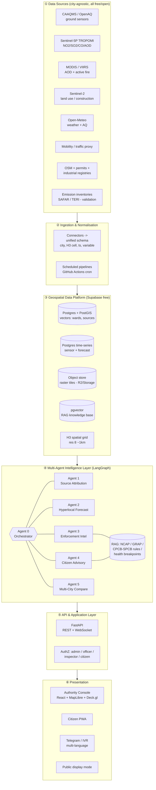
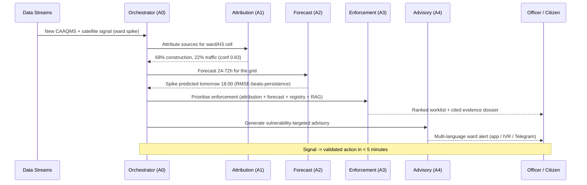

# Product Requirements Document (PRD)
## VayuNetra — AI-Powered Urban Air Quality Intelligence for Smart-City Intervention

> **Tagline:** *"We don't just measure the air. We trace it, predict it, and act on it."*
> **Positioning wedge:** Every existing tool **measures** pollution. VayuNetra **assigns the source, forecasts the spike, and triggers the intervention.** We are an *action engine*, not another dashboard.

---

### Document Control

| Field | Value |
|---|---|
| **Project / Product name** | VayuNetra ("the eye on the air") — *working name; alternates: VayuDrishti, AirIQ, SourceAQ, PranaGrid* |
| **Hackathon** | Economic Times AI Hackathon 2026 (2nd Edition) |
| **Problem Statement** | **PS5 — AI-Powered Urban Air Quality Intelligence for Smart City Intervention** |
| **Theme** | Smart Cities / Environmental Intelligence / Geospatial Analytics / Public Health |
| **Goal** | Win **#1**. Nothing below. |
| **PRD version** | v1.4 (synced with [ARCHITECTURE.md](ARCHITECTURE.md)) |
| **Status** | Draft for team alignment |
| **Team size** | 2–3 people (lean, full-stack capable) |
| **Build timeline** | Time is **not** a constraint — phase-gated, ambition-maximised |
| **Infra cost** | **₹0 — 100% free-tier** (no paid services anywhere; see [ARCHITECTURE.md](ARCHITECTURE.md) §5) |
| **Target cities** | **City-agnostic architecture from day one**; showcase trio: **Delhi** (depth + impact), **Bengaluru** (Kannada advisory + "clean city deteriorating" story), **Mumbai** (coastal dispersion + Marathi) |

---

## Table of Contents

1. [Executive Summary](#1-executive-summary)
2. [Problem Context (faithful to PS5)](#2-problem-context-faithful-to-ps5)
3. [The Gap & Our Thesis](#3-the-gap--our-thesis)
4. [Goals, Objectives & Success Metrics](#4-goals-objectives--success-metrics)
5. [Win Strategy — Judging & Evaluation Alignment](#5-win-strategy--judging--evaluation-alignment)
6. [Target Users & Personas](#6-target-users--personas)
7. [Product Scope](#7-product-scope)
8. [Core Features — The Five Agents](#8-core-features--the-five-agents)
9. [System Architecture](#9-system-architecture)
10. [Technology Stack](#10-technology-stack)
11. [Data Sources & Data Strategy](#11-data-sources--data-strategy)
12. [AI / ML Methodology](#12-ai--ml-methodology)
13. [Validation & Evaluation Plan](#13-validation--evaluation-plan)
14. [UX / Product Design](#14-ux--product-design)
15. [Scalability & Multi-City Design](#15-scalability--multi-city-design)
16. [Implementation Roadmap (Phase-Gated)](#16-implementation-roadmap-phase-gated)
17. [Team & Roles](#17-team--roles)
18. [Risks & Mitigations](#18-risks--mitigations)
19. [Deliverables & Demo Narrative](#19-deliverables--demo-narrative)
20. [Business Impact, Market & Go-to-Market](#20-business-impact-market--go-to-market)
21. [Appendix](#21-appendix)

---

## 1. Executive Summary

India's air-quality crisis kills an estimated **1.67 million people every year** (Lancet Planetary Health) and is no longer a Delhi-only problem — it is a national urban emergency. The country has already deployed **900+ Continuous Ambient Air Quality Monitoring Stations (CAAQMS)**, yet a **2024 CAG audit found only 31%** of cities with monitoring data had *any* actionable multi-agency response protocol linked to those readings. **The data exists. The intelligence layer to act on it does not.**

City administrators do not need another dashboard that shows them a red number. They need three things that **do not exist together anywhere today**:
1. **Source attribution** — *which* sources are responsible at *this* location, *right now*.
2. **Hyperlocal forecasting** — what AQI will be in 24–72 hours at **ward / 1 km** resolution.
3. **Enforcement intelligence** — *where* to deploy limited inspectors for maximum impact.

**VayuNetra** is a city-agnostic, multi-agent AI platform that fuses CAAQMS ground sensors, **Sentinel-5P / MODIS satellite** data, mobility feeds, meteorological forecasts, and geospatial land-use layers into a single **action engine**. It runs five coordinated AI agents — **Source Attribution, Hyperlocal Forecast, Enforcement Prioritisation, Citizen Advisory, and Multi-City Comparative Intelligence** — that move a city from *reactive monitoring* to *proactive, evidence-based intervention*.

**Our North-Star Metric:** collapse the **time from pollution signal → validated, source-attributed enforcement action** from the *weeks-or-never* the CAG audit documents, down to **minutes**.

**Why we win #1:** we hit every judging axis deliberately — a genuinely novel **satellite-ground "blame map"** (Innovation), a forecast that **provably beats the persistence baseline** with numbers (Technical Excellence + Business Impact), a **city-agnostic engine live across 10 cities** (Scalability), and a **map-first console + multi-language citizen advisory** (User Experience) — all wrapped in an India-scale, life-and-death business case.

---

## 2. Problem Context (faithful to PS5)

> This section preserves the exact framing and figures from the official PS5 brief so the whole team works from ground truth.

**The crisis is national, not local.**
- **Delhi** averaged an **AQI of 218** (classified *Poor* or worse) for **over 200 days** in 2024-25.
- **Mumbai** recorded dangerous AQI levels on **over 60 days** in 2024.
- **Kolkata** averaged AQI **above 150** for large parts of the winter season.
- **Bengaluru and Chennai** — long considered relatively clean — have seen **measurable deterioration** as vehicle density and construction activity surge.
- CPCB's National Air Quality data for 2024 shows **24 of India's 50 most polluted cities are Tier-1 or Tier-2 urban centres**.

**The human cost.** The Lancet Planetary Health journal estimated **1.67 million premature deaths annually** from air pollution in India — a public-health burden falling disproportionately on urban populations.

**The intelligence gap.** Despite **900+ CAAQMS** under the National Clean Air Programme (NCAP), a **2024 CAG audit found only 31%** of cities with monitoring data had any actionable multi-agency response protocols linked to those readings.

**The official challenge (verbatim intent).** *Build an AI-powered Urban Air Quality Intelligence platform that fuses monitoring station data, satellite imagery, mobility feeds, meteorological forecasts, and geospatial land-use layers to move from reactive monitoring to proactive, evidence-based intervention — giving city administrators the tools to reduce pollution **at source** rather than just measure it.*

**What the brief explicitly says cities need (our design contract):**
> *"City administrations need more than dashboards. They need geospatial attribution (which sources are responsible at this location, right now), predictive forecasting (what will AQI be in 24 hours at ward level), and enforcement intelligence (where to deploy inspectors for maximum impact). That combination does not exist today."*

---

## 3. The Gap & Our Thesis

### 3.1 Why existing solutions fall short

| Existing class | What it does | What it *can't* do |
|---|---|---|
| CPCB / SAFAR dashboards | Show current & historical AQI | No source attribution, no hyperlocal forecast, no enforcement targeting |
| Consumer apps (IQAir, etc.) | Display AQI + generic "wear a mask" advice | No authority workflow, no source-level action, no India-language local advisory |
| Academic apportionment studies | Accurate source split | One-off, months-late, not real-time, not operational |
| GRAP (Graded Response Action Plan) | Rule-based escalation | Coarse (city-wide), reactive, not predictive, not source-targeted |

**The white space:** nobody fuses **real-time** attribution + **hyperlocal** forecast + **operational** enforcement + **citizen** advisory in one continuously-updating, city-agnostic system.

### 3.2 Our thesis

> **Pollution is not an information problem. It is an *action* problem.** The signal is everywhere (900+ stations, free satellite passes, open weather). What's missing is the layer that turns signal → **attributed cause** → **predicted spike** → **prioritised, evidence-backed action** → **protected citizen**. VayuNetra is that layer.

**One-line pitch we repeat on every slide:** *"We don't measure pollution. We assign blame and trigger action."*

---

## 4. Goals, Objectives & Success Metrics

### 4.1 Primary goal
Win **1st place** at ET AI Hackathon 2026 on PS5 by maximising the weighted judging score and beating every metric named in the official **Evaluation Focus**.

### 4.2 Product objectives
1. Attribute urban pollution to source categories at **ward / H3-cell** resolution with calibrated confidence.
2. Forecast AQI **24–72h ahead at ~1 km resolution** and **beat the persistence baseline** measurably.
3. Generate **prioritised, evidence-backed enforcement** recommendations an officer can act on.
4. Deliver **ward-level, multi-language citizen health advisories** across app / IVR / WhatsApp.
5. Prove the engine is **city-agnostic** by running it live on **≥3 cities**.

### 4.3 Success metrics (North Star + KPIs)

| Metric | Definition | Target |
|---|---|---|
| **North Star: Signal-to-Action latency** | Time from an AQI/satellite signal to a validated, source-attributed enforcement recommendation | **< 5 minutes** (vs weeks/never today) |
| Forecast skill | RMSE improvement vs **persistence** baseline @24h | **≥ 25%** (stretch ≥ 35%); if realistic ~15–20%, report it honestly **and also beat climatology** — rigour beats inflated claims |
| Attribution agreement | Agreement of source split vs published inventory (SAFAR/TERI) | **Within ±15–20% per major category** (report honestly; even ±20% with confidence scores is credible) |
| Enforcement precision | **Rubric-proxy** (CPCB/GRAP-derived) "would-act" score on top-10 recommendations | **≥ 80%** |
| Language coverage | Citizen advisory languages supported | **≥ 4** (Hindi, English, Kannada, Marathi; Tamil = extensible stretch) |
| Scalability proof | Cities onboarded with **zero code change** (config only) | **≥ 3** live |

---

## 5. Win Strategy — Judging & Evaluation Alignment

The judging criteria are **identical across all 8 problem statements**. We engineer the product so each feature *visibly* earns points on a specific axis.

> ### 🏆 Why VayuNetra wins #1 — in one breath
> It is the **only** entry that turns India's air *data* into *action*: a satellite-ground **blame map** (Innovation) → a forecast that **provably beats persistence** with held-out backtests (Technical) → a **<5-minute signal-to-action** loop with cited, court-defensible enforcement (Business Impact) → a **city-agnostic engine live across 10 cities (7 onboarded from config)** (Scalability) → a **map-first console + multilingual citizen advisory** (UX). Built **100% free (₹0)** and **demo-proofed to never break live**. *Every metric the brief names, we put a number on a slide.*

### 5.1 Judging criteria → feature mapping

| Criterion | Weight | How VayuNetra wins it |
|---|---|---|
| **Innovation** | **25%** | Satellite-ground **source "blame map"** with confidence scores; physics-informed ML; an *action engine*, not a dashboard. The framing — "assign blame, trigger action" — is itself the differentiator. |
| **Business Impact** | **25%** | India-scale: 1.67M deaths, 131 NCAP cities, ₹-quantified health/enforcement savings; signal-to-action latency cut from weeks → minutes; baseline-beating forecast quantified. |
| **Technical Excellence** | **20%** | Genuine **multi-agent orchestration** + **geospatial** engine + **RAG** + **atmospheric dispersion** + a forecast that **provably beats persistence** with held-out backtests. |
| **Scalability** | **15%** | **City-agnostic** data abstraction + H3 grid; **live multi-city** demo; cloud-native, config-driven onboarding; clear path to all 131 NCAP cities. |
| **User Experience** | **15%** | **Map-first** authority console (blame map, forecast time-slider, enforcement worklist) + **multi-language** citizen channel (app/IVR/WhatsApp). Beautiful, fast, role-aware. |

### 5.2 Evaluation Focus → proof we will show (this is what separates #1 from the pack)

The brief's Evaluation Focus names five things. **Most teams will demo a UI. We will show evidence against each.**

| Evaluation Focus item | Our concrete proof artifact |
|---|---|
| Source attribution accuracy vs **ground-truth emission inventories** | Side-by-side: our ward apportionment vs SAFAR/TERI study; agreement table + map overlay |
| AQI forecast accuracy at hyperlocal resolution (**RMSE vs persistence baseline**) | Backtest report: RMSE/MAE @24/48/72h, **our model vs persistence vs climatology**, with skill-score % |
| Enforcement recommendation quality **rated by domain experts** | Top-10 recommendations + auto-generated cited evidence dossiers, scored on a transparent **CPCB/GRAP-derived rubric proxy** (no expert needed; independent expert validation = planned next step — see [ARCHITECTURE.md](ARCHITECTURE.md) §14) |
| Citizen advisory **relevance & language coverage** | Live multi-language advisory (**Hindi / English / Kannada / Marathi**) + readability + native-speaker review |
| **Demonstrated reduction in response time** from signal to intervention | Timed demo: signal → attribution → enforcement packet in minutes; contrast with CAG-documented status quo |

> **Strategic principle:** *If the brief names a metric, we will put a number on it on a slide.* That single discipline is our biggest edge.

---

## 6. Target Users & Personas

| Persona | Role | Core "job to be done" | What VayuNetra gives them |
|---|---|---|---|
| **Priya — City Pollution Control Officer (SPCB)** | Decides daily air-quality response | "Where is the problem coming from and where do I send my 4 inspectors today?" | Blame map + ranked enforcement worklist + evidence dossiers |
| **Rajan — Municipal Commissioner / Smart City CEO** | Policy & accountability | "Are our interventions working? How do we compare to other cities?" | Multi-city comparative dashboard + intervention effectiveness tracking |
| **Field Inspector** | Executes enforcement | "Is this site actually the culprit, and what's my legal basis?" | Geo-tagged evidence packet + regulatory citation (RAG) |
| **Citizen (incl. vulnerable groups)** | Self-protection | "Is the air dangerous for my child / my outdoor job today, in my language?" | Ward-level, multi-language advisory via app / IVR / WhatsApp |
| **CPCB / Policy analyst** | National oversight | "Which cities, which sources, which seasons need funding & rules?" | Cross-city trends, compliance metrics, source patterns |

**Primary buyer/user for the demo:** the **City Pollution Control Officer** + **Municipal Commissioner** — the people who can *act*. Citizens are the impact multiplier.

---

## 7. Product Scope

### 7.1 MVP (must exist for a credible win)
- City-agnostic data ingestion for **10 cities** (CAAQMS + satellite + weather + land use).
- **Source Attribution Agent** (Agent 1) producing ward/H3 apportionment + confidence.
- **Hyperlocal Forecast Agent** (Agent 2) @24–72h, ~1 km, **with persistence baseline comparison**.
- **Authority console**: blame map + AQI layer + forecast time-slider.
- **Enforcement Agent** (Agent 3): ranked worklist + auto evidence dossier (RAG-cited).
- **Citizen Advisory Agent** (Agent 4): ward alerts in **≥3 languages**, at least app + IVR/WhatsApp text.
- Backtest/validation report (the evidence artifacts in §5.2).

### 7.2 Finale upgrades (to lock #1)
- **Multi-City Comparative Intelligence** (Agent 5) + intervention-effectiveness analytics.
- Deep-learning forecast upgrade (spatiotemporal GNN / TFT) over the gradient-boosting MVP.
- Full atmospheric **dispersion modelling** (Gaussian plume + wind-field advection) as physics prior.
- **Enhanced AI models (§8 ⚡):** Satellite Vision source detection (E1), Dense-coverage AOD→PM2.5 + 1km downscaling (E2), What-if intervention simulator (E3); **prescriptive optimiser (E5), multimodal satellite-evidence dossiers (E6), health & carbon quantification (E7)**; spike/anomaly detector (E4, stretch).
- Live cloud deployment with a public demo URL + IVR phone number that judges can call.
- Polished demo video + pitch deck + architecture diagram.

### 7.3 Out of scope (explicitly)
- Deploying new physical sensors / hardware (we consume existing CAAQMS + satellite).
- Regulatory/legal e-filing integration with government systems (we *generate* the dossier; filing is future).
- Nationwide rollout to all 131 cities during the hackathon (we *prove* the path with 3).

### 7.4 Future roadmap (post-hackathon, shows vision)
- Indoor air + wearable integration; hospital-admission correlation; carbon co-benefit tracking; private-sensor crowd network fusion; full GRAP automation; SPCB system integrations.

---

## 8. Core Features — The Five Agents

> All five map directly to the PS5 "What You May Build" list. Each spec includes inputs, outputs, method, the **demo moment**, and **acceptance criteria**.

### Agent 0 — Orchestrator / Supervisor (the multi-agent backbone)
- **Purpose:** Coordinate the specialist agents, maintain shared state (city, time window, ward/H3 cell), enforce human-in-the-loop gates, and expose a single conversational + API surface.
- **Method:** Stateful agent graph (LangGraph) with typed shared memory; tool-calling; guardrails; trace logging for auditability.
- **Why it matters:** This is what makes us a **genuine multi-agent system** (what the organizers signal across every PS), not a pipeline of scripts.

### Agent 1 — Geospatial Pollution Source Attribution Engine ⭐ (our hero)
- **What it does:** Attributes pollution to **source categories** — `{vehicular/traffic, construction & road dust, industrial, biomass/waste burning, regional/transported, other}` — per **ward / H3 cell**, with **statistical confidence scores**.
- **Inputs:** CAAQMS pollutant mix (PM2.5, PM10, NO₂, SO₂, CO, O₃), **Sentinel-5P** (NO₂, SO₂, CO, aerosol index), **MODIS/VIIRS** AOD + active-fire/thermal anomalies, **Sentinel-2** land-use & construction-site change, traffic density, OSM land use, industrial/permit registries, wind field.
- **Method:** **Physics-informed ML** — chemical-signature priors (e.g., NO₂↑ → combustion/traffic; SO₂↑ → industrial; AOD + fire pixels → biomass burning; coarse-PM/PM10:PM2.5 ratio → dust/construction) + a learned apportionment model calibrated against published source-apportionment studies; spatial smoothing over the H3 grid.
- **Output:** Per-cell source-share vector + confidence; the **"blame map"**.
- **Demo moment:** Click a red ward → *"68% construction dust, 22% traffic, 10% transported — confidence 0.83,"* with the satellite + sensor evidence that proves it.
- **Acceptance:** Apportionment within **±15%** per major category vs SAFAR/TERI on validation wards.

### Agent 2 — Hyperlocal Predictive AQI Forecasting Agent ⭐ (our proof-of-rigor)
- **What it does:** Forecasts AQI **24–72h ahead at ~1 km (H3 res 8 ≈ 0.7 km²) grid** across the whole city.
- **Inputs:** Meteorological forecasts (wind speed/direction, boundary-layer height, temp, humidity, precip — IMD/GFS/ERA5/OpenWeather), traffic & **seasonal emission calendars** (Diwali, stubble-burning windows, winter inversion), persistence & climatology features, **atmospheric dispersion** output as a physics feature.
- **Method (staged):** MVP = gradient-boosting (LightGBM/XGBoost) spatiotemporal model with engineered met + lag features; **Finale = spatiotemporal GNN / Temporal Fusion Transformer**. **Baselines = persistence + climatology.** Prediction intervals via quantile regression.
- **Output:** Gridded 24/48/72h AQI forecast + uncertainty bands + "spike alerts."
- **Demo moment:** Time-slider scrubs 72h forward; a spike lights up tomorrow 6 PM in a ward → triggers a pre-emptive advisory + enforcement pre-position.
- **Acceptance:** **≥25% RMSE reduction vs persistence @24h** on a held-out test period.

### Agent 3 — Enforcement Intelligence & Prioritisation Agent
- **What it does:** Correlates current/forecast hotspots + attribution with **registered emission sources** (industries, construction sites, waste-burning spots, diesel corridors) → **prioritised, evidence-backed enforcement worklist**.
- **Inputs:** Attribution map (Agent 1), forecast (Agent 2), source registries (SPCB consent-to-operate, construction permits, OSM industrial zones, fire pixels), population-exposure layer, **RAG** over CPCB/SPCB regulations + NCAP + GRAP.
- **Method:** Exposure-weighted prioritisation score = `f(source contribution × population exposed × actionability × confidence)`; LLM-generated **evidence dossier** with regulatory citations (RAG, with sources).
- **Output:** Ranked inspector deployment list + per-target **evidence packet** (what, why, satellite/sensor proof, legal basis).
- **Demo moment:** *"Send inspectors to these 3 construction sites first — together they drive 41% of ward-12 PM2.5; here's the auto-generated notice with the CPCB rule cited."*
- **Acceptance:** **≥80%** "would-act" on top-10 via a transparent **CPCB/GRAP rubric proxy** ([ARCHITECTURE.md](ARCHITECTURE.md) §14); independent expert validation = planned next step.

### Agent 4 — Citizen Health Risk Advisory Agent
- **What it does:** Generates **ward-level health-risk alerts**, maps **population vulnerability** (hospitals, schools, outdoor workers, elderly) against **forecast** AQI, and pushes **personalised advisories** via mobile app, public displays, and **IVR in regional languages**.
- **Inputs:** Forecast (Agent 2), vulnerability layers (Census/WorldPop, OSM hospitals/schools), AQI→health breakpoints (CPCB/WHO), user profile (location, sensitivity).
- **Method:** Rule-based health-risk tiering + **LLM localisation/translation** for natural, culturally-appropriate messaging; channel adapters (PWA push, SMS, WhatsApp, IVR text-to-speech).
- **Output:** *"Bengaluru, Ward 84, tomorrow AM: AQI 'Very Poor'. Outdoor workers — shift heavy work to after 4 PM"* — delivered in **Kannada** (Bengaluru), **Marathi** (Mumbai), **Hindi/English** (Delhi); architecture extensible to all 22 scheduled languages.
- **Demo moment:** Judge calls a **live IVR number** / messages the **Telegram bot**, hears or reads a real Kannada advisory.
- **Acceptance:** ≥4 languages (hi/en/kn/mr); native-speaker-rated relevance; correct vulnerability targeting.

### Agent 5 — Multi-City Comparative Intelligence
- **What it does:** Tracks & compares AQI trends, **intervention effectiveness**, and compliance across cities; recommends "what worked in city A for city B."
- **Inputs:** All cities' historical + live data, intervention logs.
- **Method:** Causal-ish before/after intervention analysis + benchmarking; comparative geo-analytics.
- **Output:** Cross-city dashboard + intervention playbook recommendations.
- **Demo moment:** *"Delhi's construction-dust crackdown cut ward PM2.5 by X%; Bengaluru's ward-84 has the same signature — apply the same playbook."*
- **Acceptance:** ≥3 cities compared; at least one quantified intervention-effectiveness story.

---

### ⚡ Enhanced AI Models (finale upgrades — the team's CV/ML firepower)

> These raise **Technical Excellence + Innovation** and fill real data gaps. Scope = **finale upgrades** layered on the core 5 agents (balanced scope); E4 is the lowest-priority stretch. Full training detail in §12.

**E1 — Satellite Vision: Source Detection (trained CV)** ⭐
- **What:** A trained CNN / semantic-segmentation model on free **Sentinel-2 / Landsat** imagery that detects **active construction sites, brick kilns, and open-burning scars**.
- **Why it matters:** Open construction-permit data barely exists per city — this model *generates* that missing layer from satellite, feeding Agent 1 (attribution) and Agent 3 (enforcement). Closes our biggest data gap and showcases the team's CV strength.
- **Demo moment:** Toggle the "detected sources" layer → freshly-detected construction sites light up and auto-populate the enforcement worklist.

**E2 — Dense-Coverage ML: AOD→PM2.5 + 1km Downscaling (trained)** ⭐
- **What:** (a) a model mapping satellite **Aerosol Optical Depth → ground PM2.5**, and (b) an ML **downscaling/super-resolution** model fusing sparse stations + satellite into a dense **1km** field.
- **Why it matters:** Delivers AQI **everywhere**, not just at the ~40 stations a city has — this is what makes "hyperlocal at 1km" *real* rather than interpolated guesswork.
- **Demo moment:** Switch from "stations only" (sparse dots) to "VayuNetra dense grid" (full-city 1km heatmap).

**E3 — Intervention What-If Simulator** ⭐
- **What:** Reuses the forecast + dispersion engines to simulate interventions — *"halt construction in ward X / divert this diesel corridor → projected AQI change tomorrow."*
- **Why it matters:** Turns the platform from *predictive* into *prescriptive* decision-support — exactly the "reduce pollution **at source**" intent of the brief. A killer interactive demo moment.
- **Human-impact quantification (Business-Impact gold):** every simulated intervention reports **"≈ N people protected · ≈ T tonnes PM2.5 avoided · exposure-hours reduced"** by overlaying the ΔAQI on the WorldPop population layer — turning an abstract AQI drop into lives and tonnes. *(E7 extends this with ₹ health-cost savings, respiratory cases prevented, and CO₂e co-benefit.)*
- **Demo moment:** Officer toggles *"pause construction, Ward 12"* → the map re-forecasts, AQI drops 'Very Poor' → 'Moderate', and a card reads *"≈ 18,000 people protected · ≈ 2.3 t PM2.5 avoided tomorrow."*

**E4 — Spike / Anomaly Detector (trained, stretch)**
- **What:** A trained model that flags abnormal pollution events (a new illegal burn, an industrial upset) against the normal diurnal/seasonal baseline.
- **Why it matters:** Catches the *novel* event a static threshold misses — feeds proactive enforcement. Lowest-priority stretch.

**E5 — Prescriptive Intervention Optimiser** ⭐ (extends E3)
- **What:** Beyond single what-if toggles, a constrained optimiser recommends the **best bundle of 2–3 interventions** (e.g., *halt construction in Ward 12 + divert diesel corridor X + inspect 4 CV-detected sites*) that maximises AQI reduction **under an inspector-hour / budget limit**.
- **Why it matters:** It answers the officer's *real* question — *"what's the best use of my 4 inspectors tomorrow?"* — moving the platform from predict → prescribe → **optimise**. Almost every other team stops at single-toggle what-if. **Innovation + Business Impact.**
- **Method:** greedy / priority-knapsack search over the E3 simulator (dispersion + forecast), scoring each candidate by exposure-weighted ΔAQI per unit resource; returns **top-3 ranked action packages** with trade-offs. (No new model — search over the existing engines.)
- **Demo moment:** *"Optimise for tomorrow's spike under 20 inspector-hours"* → map shows the recommended package: *"−18 AQI · protects 42k people · 12 inspector-hours."*

**E6 — Multimodal RAG: Satellite Visual Evidence** ⭐
- **What:** Enforcement dossiers cite not just regulations but the **actual Sentinel-2 image patch** showing the offending construction/burning, via CLIP-style image embeddings stored alongside the text RAG.
- **Why it matters:** Multimodal RAG is rare in hackathons; it makes enforcement **visceral and court-defensible** — the officer (and the judge) *sees* the satellite proof next to the cited rule. **Innovation + Technical Excellence.**
- **Method:** a free CLIP / vision encoder (sentence-transformers) embeds Sentinel-2 patches → pgvector; the dossier retrieves the most relevant patch + the governing CPCB/GRAP rule. Pretrained encoder — no custom training.
- **Demo moment:** open a dossier → *"Here is the Sentinel-2 patch from 2 days ago showing the active dust plume,"* beside the cited regulation.

**E7 — Health & Carbon Impact Quantification** ⭐
- **What:** A quantification layer that converts every attribution / forecast / what-if / optimiser output into **public-health and carbon terms**: *≈ ₹X crore health costs avoided · N asthma & respiratory exacerbations prevented · T tonnes CO₂e co-benefit*, using standard dose-response (WHO/CPCB) and emission factors.
- **Why it matters:** ET / finance judges reward **rupee impact**; it bridges the **Sustainability** theme (national net-zero) on top of Smart Cities. Near-zero build cost (static, *cited* factor tables). **Business Impact.**
- **Demo moment:** every what-if / optimiser card and citizen advisory shows ₹ + lives + CO₂e, not just an AQI delta.

---

## 9. System Architecture

### 9.1 High-level architecture (city-agnostic, multi-agent)

### 9.2 Agent orchestration flow (signal → action)

### 9.3 Architectural principles
- **City-agnostic by construction:** every connector normalises to `(city_id, h3_cell, timestamp, variable, value, source, confidence)`. Adding a city = a config + data-source registration, **no code change**.
- **Geospatial-native:** H3 hexagonal grid (res 8 ≈ ~1 km) as the universal spatial key → clean joins across sensors, satellite, population, sources.
- **Physics + ML hybrid:** dispersion modelling and chemical priors keep the ML honest and explainable (critical for enforcement/legal credibility).
- **Auditable agents:** every agent action is traced and citable (RAG sources) — essential for enforcement defensibility and judge trust.
- **Human-in-the-loop:** enforcement actions are *recommended*, never auto-executed; officer approves.

---

## 10. Technology Stack

| Layer | Choice | Why |
|---|---|---|
| **Language** | Python (core), TypeScript (frontend) | Geospatial + ML ecosystem; team is full-stack |
| **Agent framework** | **LangGraph** (stateful multi-agent) | Controllable, traceable, typed state; better than ad-hoc chains |
| **LLM** | **Free-tier: Google Gemini Flash** (multilingual, RAG, localisation); fallbacks Groq / Ollama. Swap to Claude if the hackathon grants credits | Model-agnostic via LangGraph; $0 default |
| **Satellite / RS** | **Google Earth Engine** (Sentinel-5P/2, MODIS/VIIRS) | Free, planetary-scale, no raw-tile wrangling |
| **Geospatial** | PostGIS, **Uber H3**, GeoPandas, rasterio, Deck.gl | Industry-standard spatial stack |
| **Database** | **Supabase** Postgres 15 + **PostGIS** + **pgvector** (native partitioning for time-series) | Free tier; one DB for relational + spatial + vectors + time-series |
| **ML / forecasting** | LightGBM/XGBoost (MVP) → PyTorch (GNN/TFT, finale); scikit-learn | Fast baseline → deep upgrade path |
| **Dispersion** | Gaussian plume (custom/AERMOD-style) + HYSPLIT/wind-advection | Physics prior + explainability |
| **Backend/API** | FastAPI + WebSocket | Async, fast, typed |
| **Pipelines / scheduler** | **GitHub Actions** cron | Free scheduled data refresh + forecast / agent runs |
| **Frontend** | React + **MapLibre GL + Deck.gl** + Tailwind (Vercel) | Free, token-free maps; best-in-class geo viz |
| **Citizen channels** | **Free:** Telegram bot + PWA; IVR demo via Twilio trial; WhatsApp = production upgrade | Reach beyond smartphones (IVR for low-tech users) |
| **MLOps/Infra** | **Free-first:** Supabase (Postgres/PostGIS/pgvector/Auth) · Cloud Run free · Vercel · GitHub Actions cron · Colab/Kaggle (train) · Earth Engine (free) | $0 infra; see [ARCHITECTURE.md](ARCHITECTURE.md) §5 |
| **Observability** | Grafana + structured agent traces | Demo the "signal→action" timing live |

> **Infra = 100% free-tier (₹0).** Google Earth Engine is free for non-commercial / hackathon use; hosting via Supabase + Cloud Run free + Vercel + GitHub Actions. This is also a pitch asset — any of 131 NCAP cities can adopt VayuNetra at near-zero infra cost. Full breakdown in [ARCHITECTURE.md](ARCHITECTURE.md) §5. Architecture stays cloud- and model-agnostic.

---

## 11. Data Sources & Data Strategy

> **Everything below is publicly accessible** — matching the team's "mostly public data" reality. This is a major de-risking advantage of PS5.

| Data | Source / Access | Use | Cadence |
|---|---|---|---|
| Ground AQI (PM2.5/10, NO₂, SO₂, CO, O₃) | **CPCB CAAQMS** (data.gov.in / CPCB dashboard), **OpenAQ** API (fallback) | Truth signal, attribution, forecast target | ~Hourly |
| NO₂/SO₂/CO/Aerosol columns | **Sentinel-5P TROPOMI** via Earth Engine | Attribution (combustion/industrial signatures) | Daily passes |
| Aerosol Optical Depth + active fire | **MODIS / VIIRS** via Earth Engine | Biomass/waste-burning attribution; PM proxy | Daily |
| Land use / construction change | **Sentinel-2** via Earth Engine, OSM | Construction-dust & industrial attribution | 5-day / static |
| Meteorology + forecasts | **Open-Meteo** (free, no key — incl. Air-Quality API), IMD, ERA5/GFS | Forecast features, dispersion | Hourly/forecast |
| **Mobility feeds** (PS5-named) | **Primary (free):** OSM road network + GTFS transit + time-of-day/day-of-week traffic model + Mapbox/TomTom free-tier where available | Vehicular & diesel-corridor attribution + forecast feature | Real-time / engineered proxy |
| Industrial & permit registries | SPCB consent-to-operate lists, city construction permits, OSM industrial polygons | Enforcement targeting | Static/periodic |
| Emission inventories (**validation**) | **SAFAR**, **TERI**, REAS, EDGAR, city apportionment studies | Ground-truth for attribution accuracy | Reference |
| Population & vulnerability | Census, **WorldPop**, OSM (hospitals/schools) | Exposure weighting, advisory targeting | Static |
| Regulations & SOPs (**RAG**) | NCAP, **GRAP**, CPCB/SPCB rules, WHO/CPCB AQI health breakpoints | Enforcement basis + advisory thresholds | Static corpus |

**Data strategy notes**
- **Cold-start without live gov APIs:** if a city's live feed is flaky, we backfill from OpenAQ + historical CPCB archives so the demo never breaks.
- **Confidence everywhere:** every fused value carries a provenance + confidence so attribution/forecast outputs are defensible.
- **Validation data is sacred:** SAFAR/TERI inventories are held out *only* for evaluation, never used in training — so our accuracy claims are honest.

---

## 12. AI / ML Methodology

### 12.0 Models & Training Plan (overview)

> **Yes — this project trains real models.** The table is every trainable component, its type, training data, and free compute. The **forecast model is the hero** — it is *how we beat the persistence baseline*, the single most important number on the scoreboard. Training runs free on **Google Colab / Kaggle**; artifacts are versioned to Storage/R2; a single reproducible `evaluate.ipynb` regenerates every metric for the judges.

| Model | Type | Trained on | Free compute | Serves |
|---|---|---|---|---|
| **Forecast** ⭐ | LightGBM (MVP) → spatiotemporal GNN/TFT | historical CAAQMS + met + seasonal calendars | Colab/Kaggle GPU | Agent 2 — beats persistence |
| **Source attribution** | Gradient boosting (multi-output) + SHAP | multi-pollutant + satellite + land use, calibrated to SAFAR/TERI | Colab | Agent 1 — blame map |
| **Satellite source CV** (E1) | CNN / segmentation (transfer-learned) | labelled Sentinel-2 tiles (construction/kiln/burn) | Kaggle GPU | Agents 1 & 3 |
| **AOD→PM2.5** (E2) | Regression (GBM / small NN) | paired satellite AOD + ground PM2.5 | Colab | dense coverage |
| **1km downscaling** (E2) | CNN / learned interpolation | sparse stations + satellite + land use | Kaggle GPU | hyperlocal 1km |
| **Spike / anomaly** (E4) | STL + isolation-forest / autoencoder | historical per-cell series | Colab | proactive alerts |

*(The RAG retrieval and citizen-advisory LLM use **pretrained** models — no custom training needed there; that is the correct, efficient choice, not a gap.)*

### 12.1 Source attribution (Agent 1)
- **Hybrid, explainable approach:**
  1. **Chemical-signature priors** — ratios & tracers: `PM10:PM2.5` (dust vs combustion), NO₂ (traffic/combustion), SO₂ (industrial/coal), CO (incomplete combustion), satellite AOD + fire pixels (biomass), O₃ (secondary/photochemical).
  2. **ML apportionment** — gradient-boosting / spatiotemporal model mapping the multi-pollutant + satellite + land-use feature vector → source-share vector per H3 cell.
  3. **Calibration & confidence** — calibrate against published apportionment; output per-category confidence; spatial smoothing across neighbouring cells.
- **Explainability:** SHAP-style feature attribution so an officer sees *why* a ward was blamed on construction vs traffic.

### 12.2 Hyperlocal forecasting (Agent 2)
- **Targets:** AQI / PM2.5 per H3 cell at +24/+48/+72h.
- **Features:** met forecasts (wind, BLH, precip, temp, RH), lagged AQI, **dispersion-model output**, traffic, seasonal/event calendars (stubble windows, Diwali, winter inversions), land use, day-of-week/hour.
- **Models:** **Baseline = persistence & climatology** (mandatory, because the brief grades against persistence). **MVP model = LightGBM** with quantile loss for intervals. **Finale = spatiotemporal GNN / Temporal Fusion Transformer** sharing information across stations + grid.
- **Uncertainty:** quantile regression → prediction intervals + spike-probability.

### 12.3 Atmospheric dispersion (physics prior) — *this makes our forecast physics-informed*
- **Gaussian plume** for local point/area sources + **wind-field advection** of satellite NO₂/AOD for regional transport; optional **HYSPLIT** back-trajectories to attribute transported pollution. Feeds both attribution (transported share) and forecasting (physics feature).
- **Innovation framing (use it on the deck):** because the dispersion physics is injected as a feature/constraint into the ML forecast, this is a genuine **physics-informed ML** hybrid — not a black-box regressor. It's explainable *and* grounded in atmospheric science, which is exactly the "novel ML" depth judges look for, **without** the execution risk of a full from-scratch PINN.
- **Optional stretch (not committed):** a true **Physics-Informed Neural Network (PINN)** coupling the advection-diffusion equation into the loss. High Technical-Excellence upside but high risk for a 2–3 person team — pursue *only* if the core is flawless and time remains.

### 12.4 Enforcement prioritisation (Agent 3)
- **Score:** `priority = source_contribution × population_exposed × actionability × confidence`, computed per candidate source; ranked.
- **RAG dossier:** retrieve the governing rule (CPCB/SPCB/NCAP/GRAP), synthesise a cited, court-defensible evidence packet.

### 12.5 Citizen advisory (Agent 4)
- **Health tiering** from CPCB/WHO AQI breakpoints × vulnerability class; **LLM localisation** into regional languages with culturally-appropriate, actionable phrasing; channel adapters (push/SMS/WhatsApp/IVR-TTS).

### 12.6 Multi-city comparison (Agent 5)
- **Before/after intervention deltas** with seasonality control; cross-city signature matching to recommend proven playbooks.

### 12.7 Satellite source-detection CV (E1)
- **Approach:** label a set of **Sentinel-2** tiles for construction sites / brick kilns / open-burning, transfer-learn from a pretrained backbone (U-Net / ResNet encoder, optionally Sentinel-1 SAR for cloud-robustness); output geo-located detections → `emission_sources`.
- **Why trainable, not rule-based:** spectral + textural signatures of construction/burning are exactly what CNNs excel at; fixed thresholds fail across seasons and cities.

### 12.8 Dense-coverage models (E2)
- **AOD→PM2.5:** GBM/MLP mapping satellite AOD + met → surface PM2.5 (the established remote-sensing approach), calibrated on station pairs.
- **1km downscaling:** learned spatial super-resolution fusing sparse stations + satellite + land use → dense H3-res-8 field with uncertainty. Turns ~40 stations into a full-city 1km map.

### 12.9 Intervention what-if simulator (E3)
- **Method:** counterfactual run of the dispersion + forecast models with a source switched off/reduced → projected ΔAQI per ward + confidence. Prescriptive, not just predictive.
- **Impact quantification:** ΔAQI × population (WorldPop) × exposure-response → **people protected + PM2.5 tonnes avoided + exposure-hours reduced** per scenario (the numbers that win Business Impact).

### 12.10 Spike / anomaly detector (E4, stretch)
- **Method:** model the normal diurnal/seasonal baseline (STL + isolation forest / autoencoder); flag deviations as candidate events for proactive enforcement.

### 12.11 Responsible AI & fairness
- **Equity guard:** enforcement prioritisation must not systematically over-target low-income wards — we monitor the exposure-weighting for fairness and keep a **human-in-the-loop** approval gate.
- **Honesty:** every output carries a confidence score; validation data (SAFAR/TERI) is **never** trained on; we report real skill scores, not cherry-picked wins.
- **Privacy:** citizen advisory uses **ward-level**, not individual, location by default.

### 12.12 Training compute & MLOps (free)
- **Train:** Google Colab (free T4) + Kaggle (30h/wk GPU); checkpoint to Storage/R2. **Track:** lightweight MLflow / logged metrics; versioned artifacts. **Reproducibility:** one `evaluate.ipynb` regenerates every metric (no leakage, fixed seeds, inventories held out).

### 12.13 Prescriptive optimiser (E5)
- **Problem:** given forecast + attribution + (E1) detected sources, choose the subset of interventions that maximises exposure-weighted ΔAQI subject to an inspector-hour / budget constraint.
- **Method:** greedy / priority-knapsack over candidate interventions, each scored by simulated ΔAQI × population exposed ÷ resource cost (via the E3 engine); return top-3 ranked packages with trade-offs. **No model training** — search over the existing physics + ML simulators.

### 12.14 Multimodal RAG — satellite visual evidence (E6)
- **Method:** a free **CLIP** / vision encoder embeds Sentinel-2 patches around each active/detected source into the same pgvector store (`modality='image'`). The enforcement dossier retrieves the most relevant patch **+** the governing CPCB/GRAP rule, citing both. Pretrained encoder — no custom training.

### 12.15 Health & carbon quantification (E7)
- **Method:** static, **citable** factor tables — WHO/CPCB **dose-response** (ΔPM2.5 → attributable cases / mortality risk → ₹ health cost via standard valuation) and **emission factors** (source reduction → CO₂e co-benefit) — applied to attribution, forecast, and what-if/optimiser outputs. **Every figure cites its factor source** (honest, never an invented constant).

---

## 13. Validation & Evaluation Plan

> This section is our **#1 differentiator**. We treat the brief's Evaluation Focus as a test suite.

| # | What we validate | Method | Reported as |
|---|---|---|---|
| 1 | **Attribution accuracy** | Compare ward apportionment to SAFAR/TERI held-out inventory | Per-category agreement table + map overlay; "within ±X%" |
| 2 | **Forecast skill** | Time-split backtest (train past → test held-out weeks); compute RMSE/MAE @24/48/72h for **model vs persistence vs climatology** | Skill score = `1 − RMSE_model/RMSE_persistence`; target ≥0.25 |
| 3 | **Enforcement quality** | Score top-10 on a transparent **CPCB/GRAP-derived rubric proxy** (correct source, actionable, defensible, cited) — no domain expert required | % "would-act" ≥80% |
| 4 | **Advisory relevance & coverage** | Native-speaker review; count languages; readability | ≥4 languages (hi/en/kn/mr); relevance score |
| 5 | **Signal-to-action latency** | Instrument the pipeline; time signal → enforcement packet | Median < 5 min; contrast with CAG status quo |
| 6 | **Satellite source-detection CV** (E1) | Precision/recall on held-out labelled tiles | mAP / F1 on construction & burning detection |
| 7 | **Dense-coverage models** (E2) | AOD→PM2.5 RMSE; downscaling skill vs plain interpolation | RMSE / skill score at held-out stations |
| 8 | **What-if simulator plausibility** (E3) | Sanity vs dispersion physics + historical analogues | directional correctness + magnitude sanity |
| 9 | **Fairness / equity audit** | Partial correlation of enforcement priority with ward income, *controlling for* actual source contribution + exposure | ≈ 0 — income adds **no independent** targeting signal (priority is driven by pollution, not poverty) |
| 10 | **Optimiser quality** (E5) | Compare the optimiser's package vs best-single-action + random baselines on simulated ΔAQI per inspector-hour | Δ improvement over single-action baseline |
| 11 | **Multimodal retrieval** (E6) | CLIP patch-retrieval relevance on a held-out labelled tile set | precision@k of the cited image evidence |
| 12 | **Impact factors** (E7) | Every ₹ / health / CO₂e figure traceable to a cited WHO/CPCB/emission factor | 100% sourced — no invented constants |

**Backtesting discipline:** strict temporal splits (no leakage), validation inventories never trained on, fixed random seeds, and a reproducible evaluation notebook we can show judges live.

---

## 14. UX / Product Design

### 14.1 Authority Console (primary, web)
- **Map-first** (Deck.gl). Default view = the **Blame Map**: H3/ward choropleth coloured by *dominant source*, not just AQI.
- **Layers toggle:** live AQI · source attribution · 24-72h forecast (time-slider) · enforcement targets · population vulnerability · satellite overlays.
- **Right rail = Action panel:** ranked enforcement worklist; click a target → evidence dossier with citations + **"Generate Cited Dossier (PDF export)"** + "Dispatch / Generate Notice."
- **Top bar:** city switcher (proves multi-city), time scrubber, scenario toggle ("now" vs "tomorrow 18:00"), and a **live "Signal → Action: 2m 47s" latency widget** (visceral North-Star proof on screen).
- **Key toggles (the demo wow):** **"Detected Sources"** (E1 satellite-CV construction/kiln/burn) · **"Stations-only ↔ Dense 1km grid"** (E2) · **"What-if intervention"** (E3) · **SHAP tooltips** on the blame map (*"NO₂ + AOD drove 68% construction blame"*).
- **Comparative tab:** cross-city benchmarking + intervention effectiveness.
- **Fairness panel:** enforcement-action distribution across socio-economic wards — pre-empts any "are you over-targeting the poor?" question with a transparent answer.

### 14.2 Citizen channel
- **PWA:** ward AQI now + 72h, personalised health action, vulnerability-aware ("you flagged an asthmatic child").
- **Telegram bot + IVR:** multi-language (Hindi/English/Kannada/Marathi). **A judge can call a live number or message the bot.**
- **Public display mode:** big-screen ward board for bus stops/schools.

### 14.3 Design principles
- Every screen answers **"what do I *do*?"**, not just "what is the number."
- Confidence shown, never hidden. Sources cited. Fast (<2s map interactions). Mobile-first citizen, desktop-first authority.

---

## 15. Scalability & Multi-City Design

**Scalability is 15% of the score and a core team-chosen requirement ("multi-city from day one"). We make it visible.**

- **Config-driven onboarding:** a new city = register its CAAQMS endpoints + boundary polygon; H3 grid + satellite + weather are global by default → **zero code change**.
- **Universal spatial key (H3):** identical pipeline math for every city.
- **Stateless, containerised agents:** horizontal scale on Cloud Run/GKE; per-city pipelines run in parallel.
- **Demo proof:** run **Delhi + Bengaluru + Mumbai** live and switch between them on stage; show a 4th city onboarded *during* the demo from config alone.
- **Path to scale narrative:** 10 cities today → **131 NCAP non-attainment cities** with the same engine.

---

## 16. Implementation Roadmap (Phase-Gated)

> **Time is not the constraint** — phases are gated by *capability*, not dates. A 2–3 person team executes them largely in sequence with the lead parallelising data + frontend early.

| Phase | Goal | Key outputs | Exit gate |
|---|---|---|---|
| **P0 — Foundation** | Data spine + city-agnostic schema | Ingestion for 3 cities, H3 grid, PostGIS (Supabase), base map UI | Live AQI renders on the map for 3 cities |
| **P1 — Attribution MVP** | Agent 1 + blame map | Source apportionment + confidence + validation vs inventory | "Blame map" demo + ±15% agreement shown |
| **P2 — Forecast** | Agent 2 + baseline beat | 24-72h gridded forecast + **persistence backtest** | ≥25% RMSE skill over persistence |
| **P3 — Action layer** | Agents 3 & 4 + RAG | Enforcement worklist + dossiers; multi-language advisory + IVR | Signal→action <5 min; live IVR call works |
| **P4 — Scale & compare** | Agent 5 + 4th-city onboarding | Comparative dashboard; config-only new city | 3 cities compared + live onboard demo |
| **P4.5 — AI model upgrades** | E1 Satellite CV + E2 dense-coverage + E3 what-if + **E5 optimiser + E6 multimodal evidence + E7 health/carbon**; E4 spike if time | Trained models live; what-if re-forecasts; optimiser returns ranked packages | CV detections feed enforcement; dense 1km grid renders; dossiers cite satellite patches; ₹/health/CO₂e on every card |
| **P5 — Win polish** | Deliverables | Architecture diagram, deck, demo video, deployed URL | Dry-run pitch scores 5/5 on internal rubric |

**Parallelisation for a small team:** Person A = data/geo + dispersion; Person B = ML (attribution + forecast) + validation; Person C (or shared) = agents/LLM + frontend + citizen channels + pitch. Lead owns the demo narrative end-to-end.

---

## 17. Team & Roles

| Role | Owner | Responsibilities |
|---|---|---|
| **Lead / Demo owner** | TBD | Architecture, orchestrator, demo narrative, pitch, judge Q&A |
| **Data & Geospatial Eng** | TBD | Connectors, Earth Engine, PostGIS/H3, dispersion model, scalability |
| **ML / Forecasting** | TBD | Attribution model, forecast model, **baseline backtests**, validation report |
| **Agents / Frontend / Citizen** | shared | LangGraph agents, RAG, React/MapLibre/Deck.gl console, Telegram/IVR, multi-language |

*(2–3 people wear multiple hats; the lead must personally own the validation numbers and the demo story — those win the room.)*

---

## 18. Risks & Mitigations

| Risk | Likelihood | Impact | Mitigation |
|---|---|---|---|
| "This is just another dashboard" perception | Med | **High** | Relentless *action-engine* framing; lead with attribution + enforcement, never with an AQI gauge |
| **Live gov data feeds flaky during demo (the #1 risk)** | Med | **High** | **"Demo Mode": a frozen, versioned, deterministic snapshot** of all 3 cities (ground + satellite features + precomputed attribution/forecast/enforcement/advisories) bundled in the repo; one `DEMO_MODE=true` flag runs the *entire scored demo offline* — zero live-API dependency. The live system is *also* shown, but the demo cannot break. Plus OpenAQ fallback + pre-warm. |
| Attribution hard to validate convincingly | Med | High | Calibrate to published SAFAR/TERI; show agreement honestly; confidence scores |
| Forecast doesn't beat persistence enough | Low–Med | High | Strong met features + dispersion prior; report honest skill score; even 20% wins if rigorous |
| Scope too big for 2–3 people / "jack of all trades, master of none" | **High** | Med | **Core-first discipline:** the 5 agents + baseline-beating forecast must be flawless *before* any enhancement. E1–E4 are **finale-only** upgrades, each independently shippable — if time runs short we cut E4→E3→E2 and still have a complete, winning core. Phase gates enforce this. |
| Multi-language quality (Kannada/Tamil/Marathi) | Med | Med | Native-speaker review; LLM + human-in-loop check; keep messages short/templated |
| Compute for deep models | Low | Med | Gradient-boosting MVP first; GNN/TFT only if time/compute allow |
| Enforcement legal defensibility doubted | Low | Med | RAG citations + human-in-loop approval + audit trail |

---

## 19. Deliverables & Demo Narrative

### 19.1 Required deliverables (per PS5) — elevated to win
| Deliverable | How we make it #1-grade |
|---|---|
| **Working Prototype** | Live, cloud-deployed URL + **callable IVR number**; 3 cities switchable; real data |
| **Architecture Diagram** | The mermaid diagrams in §9, rendered cleanly; shows multi-agent + geo + RAG + dispersion |
| **Presentation Deck** | Problem (1.67M deaths) → wedge → live blame map → baseline-beating numbers → multi-city → impact → ask |
| **Demo Video** | The narrative below, ≤3 min, tight, emotional open + metric-driven close |

### 19.2 Demo / pitch narrative (the storyline that wins the room)
1. **Hook (emotional):** an outdoor worker / child in a red-AQI ward. *"1.67 million Indians die from this every year — and our cities still only **measure** it."*
2. **The gap:** CAG — only 31% of cities can *act* on their own data. Data everywhere, intelligence nowhere.
3. **Reveal the blame map (Innovation):** click a ward → *"68% construction dust, confidence 0.83"* — satellite + sensors agree. Toggle the **satellite-vision layer** (the exact construction sites our CV model detected) and switch from sparse station-dots to the **dense 1km grid**. *"We don't measure pollution. We assign blame."*
4. **Forecast (Technical proof):** scrub 72h → a spike tomorrow 6 PM; show the slide: **"25%+ better than persistence — here's the backtest."**
5. **Action (Business impact):** enforcement worklist → top-3 construction sites = 41% of the ward's PM2.5 → auto-generated, CPCB-cited notice. The dossier even **shows the Sentinel-2 image** of the plume beside the cited rule (E6). *Signal → action in under 5 minutes.*
5b. **What-if (prescriptive):** officer toggles *"pause construction, Ward 12"* → the map **re-forecasts live** and AQI drops 'Very Poor' → 'Moderate'. *"We don't just predict — we prescribe."*
5c. **Optimise (the closer):** *"optimise for tomorrow's spike under 20 inspector-hours"* → VayuNetra returns the best action bundle — *"−18 AQI · 42k people protected · ≈ ₹0.6 cr health cost avoided · ~9 t CO₂e"* (E5 + E7). *Numbers illustrative; each cites its factor.*
6. **Protect citizens (UX):** a judge **messages the live Telegram bot** (or calls the pre-verified IVR number) and gets a real Kannada advisory; phone shows the ward alert.
7. **Scale (Scalability):** switch Delhi → Bengaluru → Mumbai; onboard a 4th city from config live. *"Same engine. 131 NCAP cities."*
8. **Close (impact + ask):** the latency we collapsed, the lives at stake, the path to national scale.

---

## 20. Business Impact, Market & Go-to-Market

### 20.1 Impact thesis (India-scale, the 25% Business-Impact axis)
- **Health:** air pollution → **1.67M premature deaths/yr**; reducing source exposure even marginally has enormous QALY value.
- **Operational:** collapses signal-to-action from **weeks/never (CAG) → minutes**; turns scarce inspector capacity into a **targeted**, exposure-maximising resource.
- **Governance:** gives **131 NCAP cities** an off-the-shelf intelligence layer they currently lack.
- **Quantified (E7):** every intervention is costed in **₹ health savings · respiratory cases prevented · CO₂e co-benefit** — concrete rupee impact for the business case, plus a Sustainability / net-zero bridge.

### 20.2 Market & buyers
- **Primary:** State Pollution Control Boards, Municipal Corporations, Smart City SPVs, CPCB.
- **Funding rails:** NCAP allocations + 15th Finance Commission air-quality grants for million-plus cities + Smart Cities Mission + CSR/ESG. *(Exact figures to be cited from latest budget docs before the pitch — see Appendix assumptions.)*
- **Adjacent:** public-health agencies, real-estate/ESG reporting, insurers, schools/hospitals.

### 20.3 Go-to-market (post-hackathon vision)
1. Land 1–2 lighthouse cities (likely a Smart City SPV) as a paid pilot.
2. Prove an intervention-effectiveness number (PM2.5 ↓ in targeted wards).
3. Expand city-by-city via the config-driven engine; SaaS + per-city licensing; CPCB national tier.

---

## 21. Appendix

### 21.1 Glossary
- **AQI** — Air Quality Index. **CAAQMS** — Continuous Ambient Air Quality Monitoring Station. **NCAP** — National Clean Air Programme. **GRAP** — Graded Response Action Plan. **SPCB/CPCB** — State/Central Pollution Control Board. **AOD** — Aerosol Optical Depth. **H3** — Uber's hexagonal geospatial grid. **RAG** — Retrieval-Augmented Generation. **BLH** — Boundary-Layer Height. **TROPOMI** — sensor on Sentinel-5P. **HYSPLIT** — atmospheric trajectory/dispersion model. **TFT/GNN** — Temporal Fusion Transformer / Graph Neural Network. **SAFAR/TERI** — Indian air-quality research/inventory sources.

### 21.2 Metric definitions
- **Persistence baseline:** forecast(t+h) = value(t). The brief grades forecast skill against this.
- **Forecast skill score:** `1 − RMSE_model / RMSE_persistence` (>0 means better than persistence).
- **Attribution agreement:** |our_share − inventory_share| per category, averaged.
- **Signal-to-action latency:** wall-clock from new signal ingestion → enforcement recommendation emitted.

### 21.3 Key data links (to wire up)
- CPCB CAAQMS / data.gov.in · OpenAQ API · Google Earth Engine (Sentinel-5P/2, MODIS/VIIRS) · IMD / OpenWeather / ERA5 / GFS · OpenStreetMap · WorldPop · SAFAR / TERI inventories · NCAP & GRAP documents.

### 21.4 Figures: provenance & assumptions
- **From the official PS5 brief (firm):** Delhi AQI 218 / 200+ days; Mumbai 60+ days; Kolkata >150; 24 of top-50 cities Tier-1/2; **1.67M** premature deaths (Lancet); **900+** CAAQMS; **2024 CAG audit — only 31%** with actionable protocols.
- **Supporting figures to verify before final pitch:** NCAP "131 non-attainment cities", 15th Finance Commission air-quality grant amounts, pollution % of GDP. *Cite from primary sources in the deck; do not present unverified numbers to judges.*

### 21.5 Open questions for the team

**Resolved (locked):** ✅ cities = Delhi + Bengaluru + Mumbai (languages hi/en/kn/mr) · ✅ infra = 100% free-tier (₹0) · ✅ no mandated sponsor tools · ✅ no domain expert → CPCB/GRAP rubric proxy.

**Still open:**
1. Confirm product **name** (default **VayuNetra**) for repo + branding before scaffolding.
2. **Forecast finale model** — GNN vs Temporal Fusion Transformer: decide after the MVP backtest (pick whichever beats persistence most on held-out data).
3. **IVR for the demo** — Twilio trial calls reach only *verified* numbers, so either (a) verify the judges'/demo number in advance, or (b) use an in-app call simulation; **Telegram bot is the always-free default** regardless.
4. **Repo visibility** — make it **public** to get unlimited free GitHub Actions minutes (also an open-source pitch point).

### 21.6 Key differentiators vs competition (the "Why #1" cheat-sheet)

| Most teams will build… | VayuNetra delivers… |
|---|---|
| An AQI **dashboard** (measure) | An **action engine** — attribution → forecast → enforcement → advisory |
| A single LLM / one agent | A genuine **multi-agent** system + geospatial + RAG + **physics-informed ML** |
| "AI forecast" (no baseline) | A forecast **provably beating persistence**, reproducible live on stage |
| Generic source guesses | **Satellite-ground blame map** with confidence + SHAP + **CV-detected sources** |
| Predictive only | **Prescriptive what-if** — *"≈18k people protected, 2.3 t PM2.5 avoided"* |
| One hardcoded city | **City-agnostic** — 3 live + a 4th onboarded on stage, at **₹0** infra |
| A fragile live demo | **Demo Mode** — runs 100% offline, *cannot* break |
| Hand-waves on bias | A **quantified fairness audit** (priority driven by pollution, not poverty) |
| Predicts (maybe one what-if) | A **prescriptive optimiser** — the best intervention *bundle* under an inspector budget |
| Text-only citations | **Multimodal dossiers** — cite the actual satellite image of the violation |
| Reports AQI deltas | Impact in **₹ health savings · cases prevented · CO₂e** |

---

*End of PRD v1.4 — built to win PS5 at ET AI Hackathon 2026. Companion: [ARCHITECTURE.md](ARCHITECTURE.md) (v1.4, in sync). Next artifacts on request: data-source integration runbook, validation/backtesting notebook plan, pitch-deck outline, and a P0 starter scaffold.*
