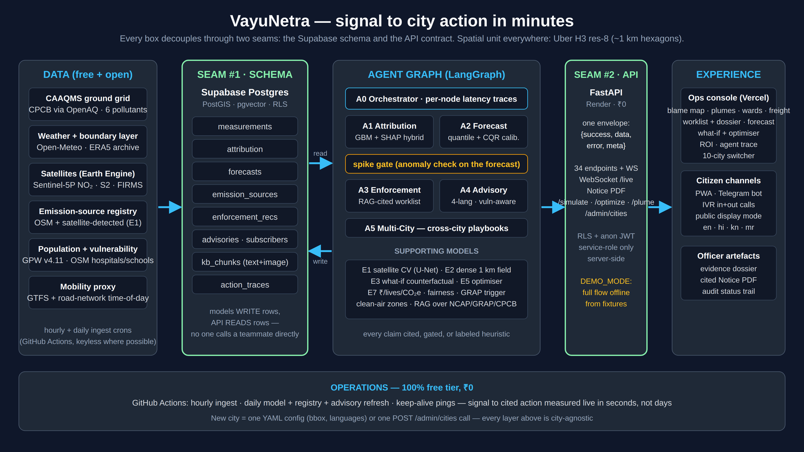

# VayuNetra

**AI-powered urban air quality intelligence for smart city intervention**
ET AI Hackathon 2026 · Problem Statement 5 · Running live in **10 Indian cities** — Delhi, Bengaluru, Mumbai, Hyderabad, Chennai, Kolkata, Pune, Ahmedabad, Jaipur, Lucknow

*System architecture. Data sources on the left, the agent pipeline in the middle, the console and citizen channels on the right. The two green columns are the seams: everything talks through the database schema and the API contract, never directly to each other.*

## Links

| | |
|---|---|
| Live app | https://vayunetra-aqi.vercel.app |
| API | https://vayunetra-c8i8.onrender.com |
| Source code | https://github.com/omkarrr88/VayuNetra |
| Demo video | https://drive.google.com/file/d/1y5FUBnXGn4iHEeUjkV7_OYeh3nOmNNTK/view?usp=drivesdk |
| Pitch deck | https://drive.google.com/file/d/1huTSRp7aQjCSWy1ueHqZKMoVvgl2S7aB/view?usp=drivesdk |
| Telegram bot | **@aqivayu_bot** (send `/start` and pick a city) |

Quickest way to see it work: open the app, click **Open console**, then click any coloured hexagon on the map. That opens the cell's full story. From there, the Enforcement section has the worklist, the evidence dossier and the draft notice PDF.

## What we built

India already has the sensors. Over 900 CAAQMS stations report air quality nationally, and yet a 2024 CAG audit found only 31% of cities with monitoring data had any response protocol attached to those readings. Measuring the air is largely solved. Acting on it is not.

VayuNetra fills that gap. It pulls together station readings, satellite imagery, weather and land use, and answers four questions for a city officer at the scale of a single square kilometre: who is polluting here right now, what the air will be like over the next three days, which site an inspector should visit first, and who needs to be warned today.

Everything keys off the same spatial unit, an Uber H3 resolution-8 hexagon of roughly one square kilometre. Attribution, forecasts, enforcement recommendations and citizen advisories all reference the same cell, so any claim the system makes can be traced from a raw measurement through to the action it produced.

## How it works

Five agents run as a single LangGraph pipeline, once per city, with a spike gate between forecast and enforcement. The orchestrator finds the cells that are spiking, attribution and forecasting run on those cells, and then a spike gate decides whether the situation actually warrants enforcement. If the air is clean, the graph skips enforcement entirely and goes straight to advisories rather than manufacturing work for an inspector.

| Stage | What happens |
|---|---|
| **Trace** | A gradient-boosting model attributes PM2.5 in each cell to traffic, construction dust, industry, biomass burning, transported pollution or other, with SHAP explanations and a confidence score. Where the model has no out-of-sample skill it abstains and falls back to cited chemical-signature priors instead of guessing. |
| **Predict** | 24, 48 and 72-hour PM2.5 forecasts per cell, with 80% prediction intervals calibrated using conformalised quantile regression. Every chart also shows the persistence baseline, so the model's value is visible rather than asserted. |
| **Act** | Emission sources are scored on contribution, population exposed, actionability and model confidence to produce a ranked worklist. Each item opens an evidence dossier with a real Sentinel-2 image of the site and regulatory citations retrieved from the national corpus — GRAP/CAQM only where they legally apply (Delhi-NCR), CPCB dust norms and NCAP elsewhere, with the issuing state board named on the notice — plus a one-click draft notice PDF for an officer to review. |
| **Protect** | Ward-level health advisories in eight languages in their own scripts (Hindi, Kannada, Marathi, Tamil, Telugu, Bengali, Gujarati, English), sent through the web app, a Telegram bot, a working IVR line and public display boards. Targeting uses 5,495 vulnerability-scored zones built from hospitals, schools, elder-care and outdoor work sites weighted by population. |

The time from a pollution signal to a cited, actionable recommendation is between 0.8 and 9.7 seconds of compute. That is measured in production, stamped per agent node, and shown in the console. It is not the time to an intervention: the officer's approval, the dispatch and the field visit are separate, timestamped steps in the same record, and the measured effect of each dispatch is tracked against the city's drift — so the whole chain, not just the model, is on the clock.

## What is in the app

- A blame map where each hexagon is coloured by its dominant pollution source. Clicking one opens the cell's place name, source breakdown, the model's SHAP evidence and its R², its own past air (daily PM2.5 up to a year, with a plain-language verdict and spike-day markers), and the 72-hour outlook — with a one-click share card. A ▶ control replays the last 24 hours across the city; source dots show their real Sentinel-2 image on hover; every view is a deep link.
- Three map modes (source attribution, Sentinel-5P satellite NO₂, and a dense 1 km PM2.5 field) plus overlays for detected sources, wind plumes, ward boundaries, freight corridors and NASA FIRMS fire/burn events.
- The enforcement worklist with filters and search, evidence dossiers, and draft notice PDFs that include a projected-impact chart showing the forecast with and without the source's contribution.
- Intervention tracking, and a PRANA-ready export: every dispatched intervention with its measured before/after effect, mapped to the NCAP spending head the city reports against — VayuNetra feeds the official portal rather than competing with it.
- A citizen complaint loop: photograph a source, it enters a public list with a 72-hour SLA clock, and once an officer verifies it the location becomes a candidate source for the next enforcement run.
- Citizen advisories with a live Telegram bot and working IVR, including an inbound line where a caller presses a digit to hear the current advisory for their city; clean-air zones with directions; and corridor exposure screening over the dense field.
- A what-if simulator for interventions like an odd-even traffic restriction or a construction dust halt, returning ΔAQI, people protected, health cost avoided and CO₂e, each figure carrying its citation, plus an optimiser that ranks intervention packages against an inspector-hour budget.
- A city ROI view with the annual health burden and what a 30% NCAP-target cut would avert, attribution-weighted guidance on where NCAP funds should go, and a fairness audit of what actually drives enforcement priority.
- A ten-city comparison ranked Swachh-Vayu style, and a live trace of the agent pipeline including a button that runs the whole thing end to end in front of you.

## Data and stack

All data sources are free and open: CPCB CAAQMS via data.gov.in and OpenAQ (plus community sensors from non-government providers, ingested at reduced confidence), Sentinel-5P and Sentinel-2 through Earth Engine, NASA FIRMS for thermal anomalies, Open-Meteo and ERA5 for weather, OpenStreetMap for the source registry, road network and ward boundaries, and GPW v4.11 for population. Ingestion runs on scheduled GitHub Actions with a rolling 90-day retention window.

The backend is FastAPI on Render with 44 routes and a WebSocket, all returning one `{success, data, error, meta}` envelope. The frontend is React with MapLibre and Deck.gl on Vercel. Data sits in Supabase Postgres with PostGIS and pgvector, protected by row-level security, with all writes going through the service role on the server. Models are LightGBM with SHAP, quantile regression with conformal calibration, a Gaussian plume model and a coverage downscaler. Retrieval is multimodal RAG over the regulatory corpus.

Adding a city means adding one YAML file with a bounding box, languages and regulatory authority, then one backfill run. There is no per-city code anywhere in the system: seven metros were onboarded that way in a single week. Infrastructure cost is zero for the ten cities running today, and we publish where that stops: measured at ~0.21 MB of readings per city per day with 180-day retention and an archive, the free tier is sized for this deployment; all 131 NCAP cities would run for about ₹2,700 a month (`docs/SCALE.md`).

## Numbers we can defend

| Claim | Result |
|---|---|
| Attribution vs published apportionment | Cosine 0.88 against SAFAR-Delhi (2018), 0.90 against CSTEP-Bengaluru (2022, verified against the primary report), 0.93 against NEERI/Urban-Emissions Mumbai (run of 18 Aug 2026); bucket-by-bucket tables against TERI-ARAI 2018 and Guttikunda et al. 2019 with the disagreements stated |
| Attribution behaves physically | Traffic SHAP contribution 2.30× higher during IST rush hours, weather controlled |
| Forecast skill vs persistence | Multi-season temporal split, monthly refit on the trailing 90 days, served forecast = LightGBM median blended with persistence: Delhi +9 / +13 / +12%, Mumbai +17 / +19 / +21%, Kolkata +14 / +10 / +9% at 24/48/72 h; alarming on the calibrated probability flags 51–54% of clean→Very-Poor onsets 1–3 days ahead where persistence is 0 by construction; live 90-day benchmarks for all 10 cities |
| Real orders, in hindsight | Winter 2025-26 CAQM GRAP escalations replayed against the served forecast: Stage III (11 Nov) and Stage IV (13 Dec) were flagged a day ahead across 99–100% of station cells (P(>120) 0.83–0.94); the two October orders were not foreseen — stated. A weather-normalised check finds no detectable reduction during the GRAP windows (Diwali night, the positive control, shows +182 µg/m³) — association only, published with the method's blind spots (`docs/OUTCOMES.md`) |
| Prediction interval coverage | Raw intervals under-covered at 48–63% against a nominal 80%; conformal calibration brought this to 78% measured on 207k Delhi test hours; every forecast also carries a calibrated P(>120) / P(>250) (Brier skill +51% / +31% vs climatology at 24 h) |
| Model selection | A Temporal Fusion Transformer was trained on GPU and rejected. LightGBM won on held-out skill in every launch city. |
| Signal to cited recommendation | 0.8–9.7 seconds of compute, measured in production; approval → dispatch → closure timestamped per action |
| Accessibility & mobile | axe-core: 0 violation types on the landing page and all 7 console sections; 390-px mobile check: no horizontal overflow, ≥ 24 px tap targets (`docs/qa/`, rerunnable scripts) |
| Test coverage | 204 backend tests (64% line coverage, CI gate 55%) and 16 end-to-end browser flows (7 smoke in CI + 9 live officer-journey), run on every push |

Current live scale (18 Aug 2026; the landing page reads these live): 10 cities, 16,529 modelled cells, 647 emission sources, 5,495 vulnerability zones and ~480 enforcement recommendations, every one of which carries a real Sentinel-2 image and retrieved citations. All of the validation above is reproducible from the notebook in the repository.

## What it deliberately will not do

Some of the more useful decisions were about what to leave out.

- The attribution model abstains rather than guessing. Below its skill threshold it says so and falls back to cited priors.
- Health advice is generated from deterministic templates, not a language model, so it cannot hallucinate medical guidance. Hindi and Marathi templates are native-speaker reviewed (team members); Kannada, Tamil, Telugu, Bengali and Gujarati are script-validated with native-speaker review pending — status per language in `docs/ADVISORY_REVIEW.md`. Enforcement recommendations are scored on a transparent CPCB/GRAP-derived rubric; the independent expert-review protocol is published (`docs/EXPERT_RATING_SHEET.md`) and no external ratings have been collected yet — we say so rather than imply otherwise.
- Notices are drafts. They carry a "pending officer authorisation" stamp and are never sent automatically — and they never cite an instrument that does not bind that city.
- Impact figures return null rather than fall back on invented constants, and sources contributing under 2% never reach the worklist.
- No socio-economic data exists anywhere in the pipeline or the schema, so enforcement priority cannot encode income or land value. The fairness audit publishes what does drive it.

## Running it

The repository is offline-first and needs no API keys to start. Copy `.env.example` to `.env`, leave `DEMO_MODE=true`, then `make install` and `make dev`. That brings up the API on port 8000 and the app on 5173, serving the full ten-city flow from bundled fixtures. `make test` runs the backend suite. Going live additionally requires linking a Supabase project and pushing the thirteen migrations.

## What is next

- Replacing the linear rollback in the what-if engine with InMAP/PAVITRA source-receptor matrices for policy-grade counterfactuals.
- A learned satellite CV detector so source detection moves off the Earth Engine heuristics.
- Native-speaker review of the Kannada, Tamil, Telugu, Bengali and Gujarati advisory templates (status per language is kept in `docs/ADVISORY_REVIEW.md`; every template is deterministic and script-validated), in-language IVR voices, and municipal permit registry connectors for enforcement.
