# VayuNetra — User Guide & Project Reference

*The operations layer for urban air quality — trace who is polluting, predict what comes next, act with cited evidence, protect citizens in their own script. Ten Indian cities, ₹0 infrastructure.*

Version of 18 August 2026 · Live app **https://vayunetra-aqi.vercel.app** · Source **github.com/omkarrr88/VayuNetra** · Team DaGoats.

Every screenshot in this guide was captured by an automated walkthrough of the live console on 18 August 2026 (`web/scripts/qa/full-walkthrough.mjs`), so what you see here is what the application does — the same walkthrough checks every control and every download and passed with zero errors.

---

## 1. What VayuNetra is, in one minute

Indian cities already **measure** their air (900+ CAAQMS stations) and several **forecast** it. Nothing **acts** on it: a reading turns red and no system tells a city officer *who* is polluting this square kilometre right now, *what* the air will do tomorrow, or *where* to send inspectors first.

VayuNetra is that missing operations layer. Every ~1 km² cell in a city (an H3 resolution-8 hexagon) carries four things:

| Verb | What the system does | Where you see it |
|---|---|---|
| **Trace** | Assigns PM2.5 blame per cell to traffic / construction dust / industrial / biomass burning / transported / other — a gradient-boosted model with SHAP explanations blended with chemical-signature priors, which **abstains** where it lacks out-of-sample skill | the map, the Cell Story |
| **Predict** | PM2.5 at +24 / 48 / 72 h with an 80 % conformal band and a **calibrated probability** of crossing Very Poor (>120 µg/m³) or Severe (>250) | Cell Story tiles, Forecast section |
| **Act** | Ranks emission sources by contribution × people exposed × actionability × confidence; each with the real Sentinel-2 image of the site, the regulation retrieved verbatim, a draft notice PDF; the officer approves → dispatches → **closes the case with a field finding** on an immutable audit trail; every dispatch is measured before/after | Enforcement section |
| **Protect** | Templated (LLM-free) health advisories in eight scripts — Hindi, Kannada, Marathi, Tamil, Telugu, Bengali, Gujarati, English — over the app, a live Telegram bot, an IVR line and public displays | Advisories section |

Six AI agents on one LangGraph do this in seconds of compute; the human steps (approval, dispatch, closure) are timestamped separately. It runs live in **Delhi, Bengaluru, Mumbai, Hyderabad, Chennai, Kolkata, Pune, Ahmedabad, Jaipur, Lucknow** on free tiers (Vercel + Render + Supabase + GitHub Actions). Adding a city is one YAML file.

---

## 2. Getting in

| | |
|---|---|
| **Front page** | https://vayunetra-aqi.vercel.app — what VayuNetra is, with a live ten-city board. Two doors: **Check your city's air** (the public app) and **Open console** (operations). |
| **Public app** | `/city/<id>` · `/map` · `/forecast` · `/rankings` · `/about`. Opens on Delhi. No login: reads are public under Postgres row-level security; every write goes through the server with the service role. |
| **API** | https://vayunetra-c8i8.onrender.com — `GET /health` shows `DEMO_MODE`; every endpoint returns `{success, data, error, meta}`. Full list: `docs/API_CONTRACT.md`. |
| **Run locally** | `make dev` — starts the API on :8000 (`DEMO_MODE` from `.env`) and the web app on :5173. `make prewarm` wakes and verifies the live stack (GO / NO-GO). `make test` runs the 284 backend tests. |
| **Demo mode** | `DEMO_MODE=true` serves 19 bundled fixtures with an identical UX (labelled in `/health`). The web app also falls back to bundled fixtures if the API is unreachable and shows an amber *"backend waking up — showing bundled demo snapshot"* notice (Render free tier sleeps; **retry** or wait — it clears on the first successful call). |
| **Keyboard** | In the console: **1–7** switch sections · **[ ]** cycle cities · **P** presentation mode (larger type for a projector) · **⌘K / Ctrl-K** jump to any city or section · **Esc** closes the Cell Story. |
| **Deep links** | Every console state is a URL: `/console?city=mumbai&section=forecast&cell=88608b56cbfffff&mode=pm25&layers=sources,plumes,wards,freight,fires`. |

---

## 3. The landing page (`/`)

The public front door — for citizens, judges and officers who have not opened the console yet. It reads live data where it can.

- **Hero** — the one-sentence proposition, **Open the console**, and the console screenshot.
- **The data, at a glance** — read live from `GET /landing/snapshot` (10-minute cache, stamped *as of HH:MM*): the Delhi source-mix donut (mean of the latest attribution run), every city's PM2.5 now vs +24 h forecast (sorted worst first), and the running scale — ~1 km² cells modelled, registered + satellite-detected sources, vulnerability-scored zones, live enforcement recommendations. A bundled snapshot is shown only until the API answers.

- **How it works** — trace → predict → act → protect, with the five agents and the data sources.
- **Architecture** — the two-seam architecture diagram (schema seam, API seam) — the same SVG the pitch deck uses.
- **Platform** — what runs where (Vercel, Render, Supabase, GitHub Actions) and the ₹0 point.
- **Validation** — the claim / result / how-it-was-checked table: attribution vs published apportionment (cosine 0.88 / 0.90 / 0.93 plus bucket tables), forecast skill vs persistence, the calibrated probabilities, the rejected TFT model, test counts.

---

## 4. One product, three surfaces

VayuNetra is one application wearing three faces, and they share a design system and a navigation
bar so that moving between them never moves the furniture:

| Surface | Path | Who it is for |
|---|---|---|
| **Front page** | `/` | Anyone arriving cold — what this is, and a live ten-city board |
| **Public app** | `/city/<id>`, `/map`, `/forecast`, `/rankings`, `/about` | A resident asking "what is the air here, and what should I do" |
| **Operations console** | `/console?section=…` | An officer deciding where to send an inspector today |

The same bar sits at the top of every page: the VayuNetra mark (back to the front page), the section
links, the **city selector**, the **scale toggle** (IN · CPCB / US · EPA / WHO), the light/dark
switch, and one button that crosses between the public app and the console — **Operations →** on
public pages, **Public site →** in the console.

### 4.1 The public app

Five pages, all following the chosen city:

| Page | What it answers |
|---|---|
| **Overview** (`/city/<id>`) | The city's index right now, every pollutant, the graph, where it is worst, the calendar, the yearly rhythm, health advice, and the other cities. **No map, by design** — this page is for reading numbers. |
| **Live map** (`/map`) | The 1 km grid, full-bleed, with the layer control and the cell story. |
| **Forecast** (`/forecast`) | The 72-hour outlook and the city's source mix — what happens next and why. |
| **Rankings** (`/rankings`) | All ten cities live, sortable, plus the three-scale explainer. |
| **How it works** (`/about`) | The five-step pipeline, the scales, every data source, and what the system is *not*. |

Each pollutant card carries its own sub-index on the chosen scale; the one marked **PROMINENT** is
setting the city index right now. Opening a card gives what the pollutant is, where it comes from in
an Indian city, what it does to people, and the CPCB and WHO standards it is judged against.

The graph runs 24 h (hourly means) or 7 / 30 / 365 days (daily means), for the index or any single
pollutant. Beside it, **most polluted areas right now** ranks the city's own 1 km cells — the part a
city-level number hides.

Switching the scale changes the labels, the band colours and the index number — never the measured
concentration underneath. The same air, read on the US EPA scale:

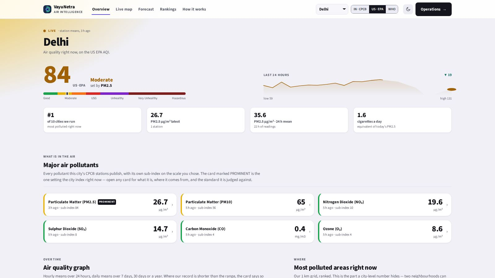

The **Live map** is the same MapLibre + deck.gl view the console uses, full-bleed, with the layer
control and the cell story:

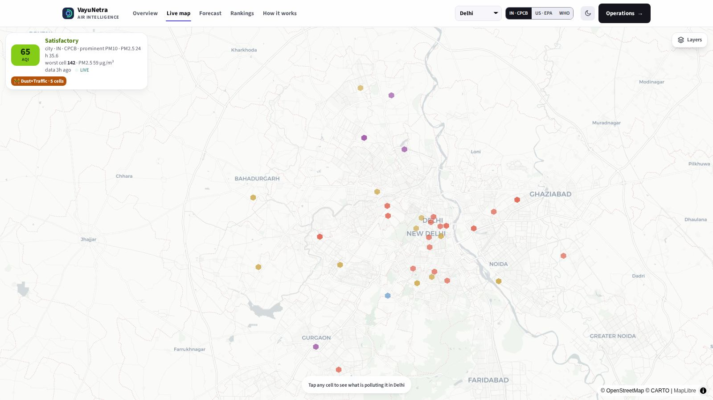

**Forecast** pairs the 72-hour outlook with the city's mean source mix — what happens next, and why:

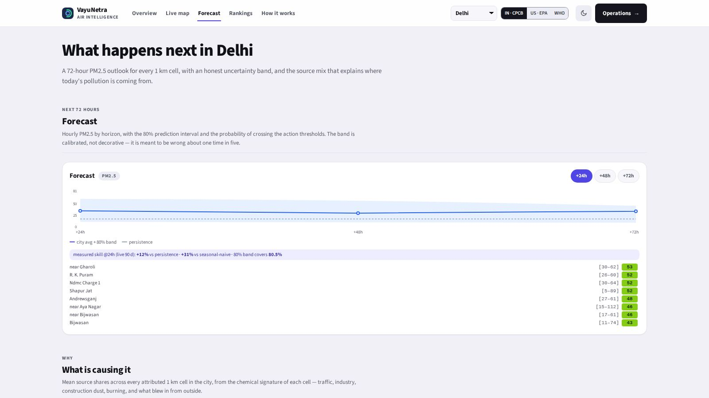

**Rankings** puts all ten cities on one board, and explains the three scales side by side:

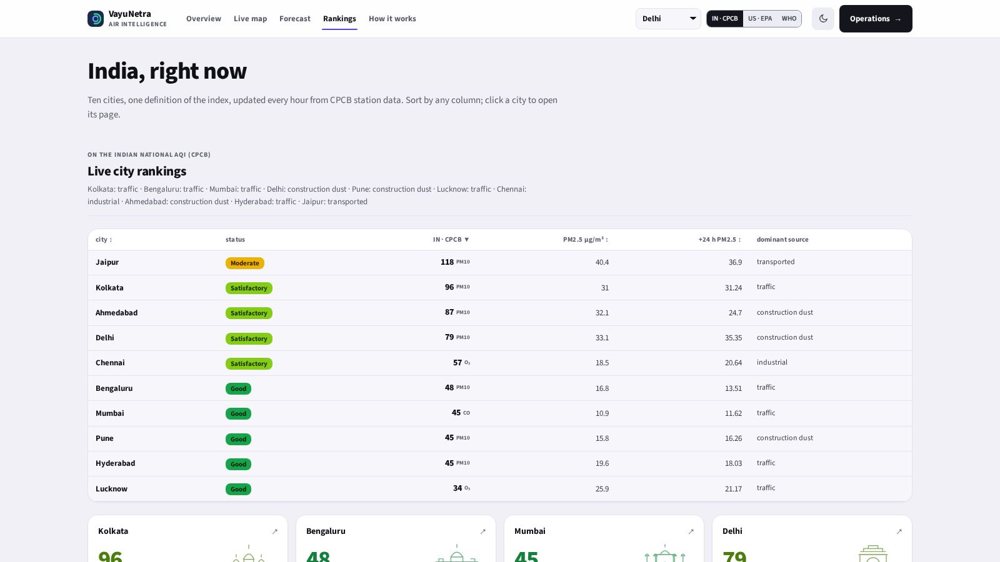

**How it works** states the pipeline, names every data source, and — as importantly — says what the
system is not: not a compliance measurement, not a legal finding, not medical advice.

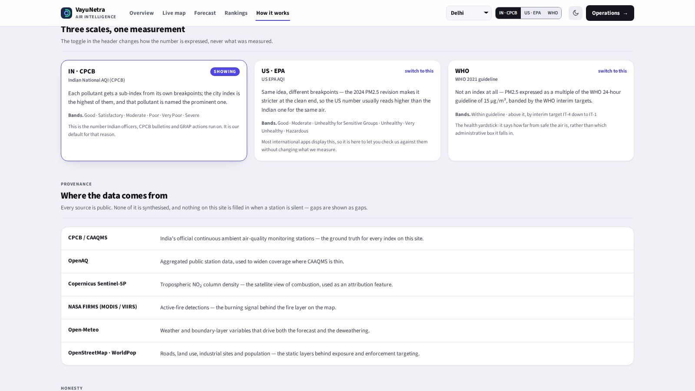

### 4.2 The console

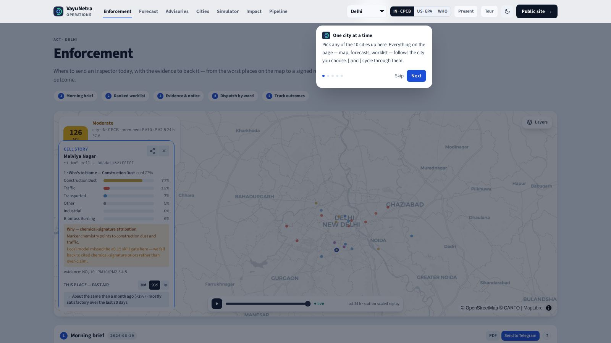

Each console section is a **full scrolling page**, not a panel in a rail. A page opens with its
**spine** — a verb (*Act*, *Anticipate*, *Inform*, *Compare*, *Decide*, *Fund*, *Trust*), one
honest sentence, and the numbered steps through it. Clicking a step number scrolls to that card;
every card carries the same number and a **?** that explains what it shows, where the numbers come
from, and what to do next.

| Section (key) | One line |
|---|---|
| **Enforcement (1)** | Where to send an inspector today, with the evidence — the officer loop. The only section that carries the map. |
| **Forecast (2)** | What the air will do in 72 h, how much to trust it, who it affects, what happened before, what is in the air now, and the record behind it |
| **Advisories (3)** | What citizens are told, in their language, over which channel — and what today's air does to people |
| **Cities (4)** | Ten cities on one scoreboard |
| **Simulator (5)** | What-if interventions and the inspector-hour optimiser |
| **Impact (6)** | The funding case: ₹, lives, where NCAP money should go, fairness |
| **Pipeline (7)** | The agents, visibly running |

Cards are sized to their content: a dense one (the worklist, the outlook) takes the full width; two
light ones sit side by side rather than stretching a slider across the page.

### 4.3 Guided tour (first run)
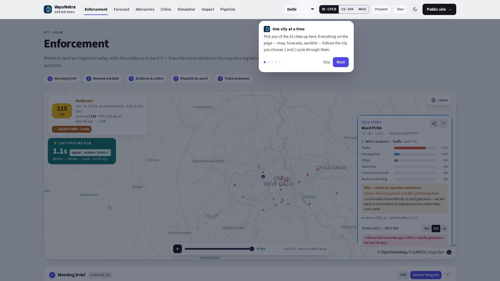

On first visit a five-step tour points at the city selector, the section nav, the map, the spine and
the worklist. It shows once (stored in the browser) and replays from **Tour** in the top bar. The
tour measures each target and places its card against it, so it stays correct if the layout changes.

### 4.4 The status strip (on the map)
- **Index tile** — the **city's** index on the chosen scale, with the pollutant setting it, the age
  of the newest reading and a **LIVE** dot. The worst *cell* is shown beneath it, labelled as such.
- **GRAP Stage · from forecast** — the stage the forecast would trigger (Delhi-NCR only; other
  cities show their own instrument).
- **Last pipeline run** — the signal → recommendation compute time of the latest agent run.

### 4.5 Presentation mode
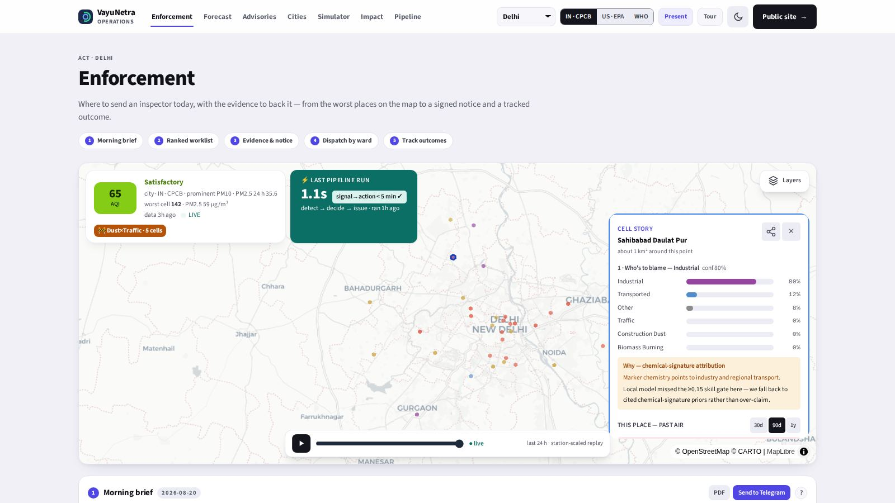

**Present** (or **P**) enlarges type and spacing for a hall projector without changing content.

### 4.6 Every screen size, both themes

The whole app is checked from a 320 px phone to a 2560 px monitor, in both themes, by
`web/scripts/qa/responsive-audit.mjs`: it computes real WCAG contrast ratios for every text node,
flags horizontal overflow, clipped text and touch targets under 44 px, and writes
`.qa-out/responsive/report.json`. On a phone the section links move into a menu sheet; nothing
scrolls sideways at any width.

The light/dark switch is in the top bar and is remembered per browser (`?theme=dark` deep-links it).
Both themes define the same design tokens, so every surface is correct in either.

---

## 5. The map

The map is a MapLibre + deck.gl view of the chosen city; every hexagon is one H3 resolution-8 cell (~1 km²).

### 5.1 The Layers chip — three view modes

Click **Layers** (top-right of the map) to expand the panel; **▲** collapses it back to a chip.

| Mode | What the hexagons show |
|---|---|
| **Sources** (default) | Who is to blame — each cell filled by its dominant source colour: traffic red · construction dust yellow · industrial purple · biomass burning orange · transported blue · other grey; opacity = dominance. Hover shows the top-3 shares and SHAP drivers. |
| **Sat NO2** | Sentinel-5P tropospheric NO₂ column (blue low → red high) — independent satellite evidence of combustion. |
| **PM2.5** | The dense ~1 km model field (E2 downscaler anchored on the live stations). Sub-toggle **Stations only ↔ Dense 1 km** shows what the model adds beyond the sparse station grid. Legend = CPCB bands. |

### 5.2 Five overlays (independent, all off by default)

- **Detected sources** — dots for the registered (OSM) and satellite-detected emission sources; **hover a dot to see its real Sentinel-2 image** (sources without one show none — never a stand-in).
- **Wind plumes** — Gaussian-plume footprints from the top sources under the live wind, with a wind-arrow grid (direction; length = speed).
- **Ward boundaries** — administrative wards, each filled by its mean PM2.5 from the dense field (value on hover). The same polygons give every place its name.
- **Freight corridors** — violet truck-route lines with entry-window notes (e.g. Delhi 23:00–07:00).
- **Fire / burn events (30 d)** — NASA FIRMS thermal detections — the stubble / waste-burning layer.

### 5.3 Play the last 24 hours

The **▶** control at the bottom of the map replays the trailing day hour by hour so the city visibly breathes through the evening peak and the morning lull; drag the slider to scrub; it returns to **live** at the end. Labelled honestly: *station-scaled replay* (each cell scaled by its nearest monitor's hourly ratio).

### 5.4 The Cell Story (click any hexagon)

The heart of the console. It opens on load for the worst cell and for any hexagon you click.

1. **Header** — the place name (ward), the raw H3 id, a **share** button (↗) and close (×).
2. **1 · Who's to blame** — the source-share bars with confidence, then one of two *why* boxes: **green — model attribution**: SHAP drivers in µg/m³ and the model's own out-of-sample R² ("passed the ≥ 0.15 skill gate"); **amber — chemical signature**: where the local model lacks skill the system says so and falls back to cited marker-chemistry priors. It never over-claims.
3. **This place — past air** — daily PM2.5 over 30 d / 90 d / 1 y drawn on the CPCB bands, a one-line verdict, and red **spike-day** markers with a data-backed reason. Cells without a long station record say which monitored cell they are borrowing and how far away it is.
4. **2 · Where it's heading** — the cell's +24/48/72 h PM2.5 with 80 % bands, coloured by AQI band, and the **calibrated probability chips** ("63 % Very Poor+", "91 % Severe").
5. **3 · Act — view enforcement actions →** — jumps to the worklist sorted nearest-to-this-cell first.
6. **Share** — renders a WhatsApp-ready PNG card of this place (blame, verdict, 90-day trend, forecast); uses the phone share sheet, else downloads.

---

## 6. Enforcement — the officer loop (section 1)

*Where to send an inspector today, with the evidence to back it — from the worst places on the map to a signed notice and a tracked outcome.* Steps: **1 Morning brief · 2 Ranked worklist · 3 Evidence & notice · 4 Dispatch by ward · 5 Track outcomes.**

### 6.1 Morning brief (step 1)

The one page a commissioner reads. Every line is a template over stored rows — no language model:
- **Air right now** — city mean PM2.5 (band) vs the same hours yesterday (▲/▼), the worst place, the 24 h outlook; if the last reading is old, its age is printed.
- **Where the air is about to turn** — cells whose calibrated P(Very Poor) ≥ 30 % at any horizon and that are not already Very Poor, with the horizon and forecast value.
- **Top actions today** — the three highest-priority open recommendations (source · place — contribution, residents exposed) with a "+N more" line.
- **Yesterday's dispatches** — each dispatched action's measured effect vs the city's drift, or the honest empty state.
- **Advisories** — worst tier issued, in how many zones and languages.
- **PDF** downloads the brief; **Send to Telegram** pushes it to the city's subscribers (real send; the API reports "skipped" honestly if no bot token is configured). The nightly pipeline sends the brief automatically.

### 6.2 Enforcement worklist (step 2)

Ranked recommendations, each titled **source type · place** with its priority and rubric score. Filters **All / Construction / Industrial / Waste**, free-text **search**, and the **acting as** field (the officer name stamped on every action; the demo has no sign-in — a deployment binds this to the authenticated user). If a cell is focused, sorting switches to *nearest first* (badge + "~N km" / "📍 this cell" chips). Identical detections in one cell collapse into one card ("+N similar sites here").

Each card: the rationale (what the source is, its % contribution, residents exposed, what to inspect, the regulatory basis), then the buttons **Evidence dossier · Notice PDF · Approve · Dismiss**.

### 6.3 Evidence dossier and notice (step 3)

- **Evidence dossier** expands in place: the **Sentinel-2 satellite patch** of the site (with detection confidence) and up to three **regulatory citations** retrieved by RAG from the NCAP / GRAP / CPCB / Air-Act corpus (GRAP/CAQM only where they legally bind — Delhi-NCR; CPCB dust norms and NCAP elsewhere), each with a match score.
- **Notice PDF** downloads a draft enforcement notice: addressee, cited provisions, 24-hour IST deadline, the satellite image, a **projected impact of compliance** chart (forecast with vs without this source's share at +24/48/72 h — a screening estimate), the issuing authority, and a **PROVENANCE** block. Stamped *DRAFT — pending officer authorisation*; the system never auto-sends. Live assembly takes 5–12 s.

### 6.4 Approve → Dispatch → Close → History

- **Approve** moves the item to its ward's field queue (step 4). **Dismiss** removes it.
- **Dispatch team** freezes the cell's 7-day PM2.5 baseline and **arms before/after tracking** (step 5); the card shows *Dispatched · tracking armed*.

- **Close case** records the field finding — *violation found · compliant · site inaccessible · not applicable* — and an optional note; **Record & close** stores it and the card shows *Closed · finding · date*.

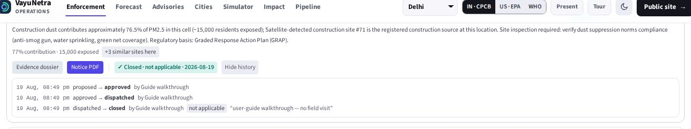

- **History** shows the audit trail: from → to, who (acting as), when, finding, note. It is append-only (`enforcement_status_log`), survives the nightly run — which refreshes evidence and priority *in place* for acted-upon items and replaces only still-proposed ones — and survives even deletion of the record.

### 6.5 Ward dispatch queues (step 4)

Approved and dispatched recommendations group into per-ward field queues (the grid-supervision pattern); wards are resolved offline from the shipped boundary polygons. Before anything is dispatched the card says so plainly.

### 6.6 Intervention tracking and PRANA export (step 5)

Each dispatched action's measured effect: the cell's PM2.5 after dispatch minus its frozen baseline, corrected for the city-wide drift over the same window (marked *provisional* for the first 7 days). **Export as NCAP action-plan evidence** downloads the PRANA-ready CSV — every tracked action with baseline / after / effect / status / closure finding, mapped to the NCAP spending head the city reports against.

### 6.7 City Intel
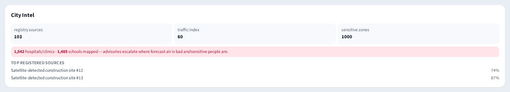

Registry-source count, traffic index, sensitive-zone count, hospitals / schools, top registered sources — the static picture behind the live one.

---

## 7. Forecast (section 2)

*What the air will do in the next 72 hours, how much to trust that, who it will affect — and what happened before.* Steps: **1 72-hour outlook · 2 How good is it, really · 3 Real orders, in hindsight · 4 Who is in the forecast · 5 The past.**

### 7.1 72-hour outlook

Horizon tabs **+24h / +48h / +72h**; the city-average forecast line with the shaded **80 % band** and the grey dashed **persistence** baseline ("tomorrow = today" — the bar to beat). The **measured skill note** under the chart is read from the benchmark artifact, never typed in. **Spike alerts** list cells forecast ≥ 90 µg/m³ (worst first). Model: LightGBM quantile regression, retrained daily per city on the trailing 90 days, blended with persistence, conformally calibrated; every cell carries P(>120) and P(>250).

### 7.2 Forecast validation (step 2)

The strict temporal-split benchmark: skill vs persistence and weekly seasonal-naive per horizon, winter-only and Very-Poor-hours slices, 80 % interval coverage, and the **early-warning line** — how many clean→Very-Poor onsets the alarm on P ≥ 0.3 flags 1–3 days ahead (persistence = 0 by construction). Toggle **multi-season / live 90d**. Negative numbers stay visible. Below it, **How today's attribution was made** — cells per method (per-cell model · shrunk to the city model mean · signature priors), median R², mean confidence, cells with a gas marker in the last 24 h. Sources: `docs/BENCHMARKS.md`, `docs/EARLY_WARNING.md`, `GET /metrics/benchmark`, `GET /metrics/attribution`.

### 7.3 Real interventions, in hindsight (step 3)
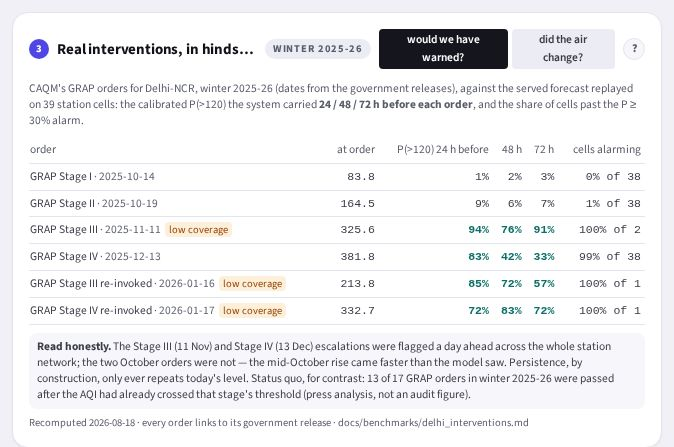
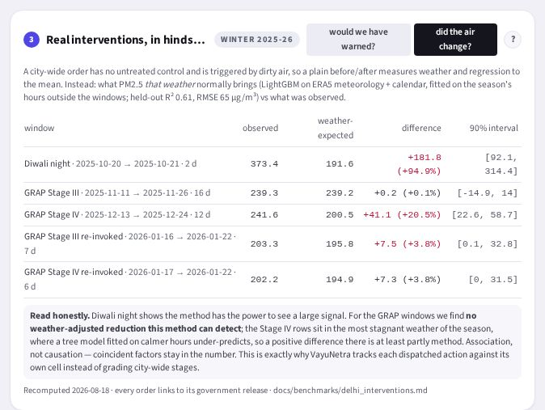

The CAQM GRAP escalations of winter 2025-26 (and Diwali night), dated from government releases (each order links to its source), replayed against the served forecast: **would we have warned?** shows P(>120) 24/48/72 h before each order and the share of station cells past the alarm (low-coverage weeks flagged); **did the air change?** shows observed vs weather-expected PM2.5 inside each window with a bootstrap interval — where the honest answer is "no detectable change", it says no. `docs/OUTCOMES.md`, `GET /metrics/interventions`.

### 7.4 City Statistics (steps 4–5)
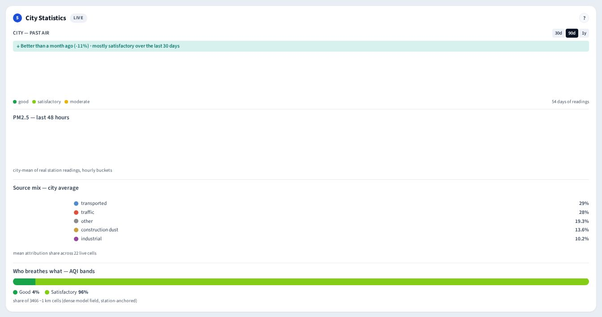

- **Who is in the forecast?** — expected people in Very Poor / Severe air at +24/48/72 h = Σ cell population × calibrated P(> band); GPW v4.11 population where sampled, cited city population otherwise; exposure, not mortality (`docs/HEALTH_IMPACT.md`).
- **City — past air** — daily PM2.5 for the whole city over 30 d / 90 d / 1 y with verdict and spike days (raw readings ∪ the archived daily rollup — Delhi's 1-year view shows the real winter).
- **Last 48 hours** — hourly station means; the live **source-mix donut**; **Who breathes what** — share of cells in each CPCB band.

---

## 8. Advisories — the citizen loop (section 3)

*Inform: what citizens are told, in their language, over which channel.* Steps: **1 Advisories by ward · 2 Send it · 3 Clean-air routes · 4 Citizen reports.**

### 8.1 Citizen Advisory

Ward-level advisories tiered by forecast risk and vulnerability. **Language dropdown**: the city's showcase language first (Hindi in Delhi, Marathi in Mumbai/Pune, Kannada in Bengaluru…), then the others — full native-script text from deterministic templates (LLM-free by design, so medical advice cannot be hallucinated; script-validated in code; native-speaker review status per language in `docs/ADVISORY_REVIEW.md`). **Channel tabs** show how the same advisory renders on each channel:

- **App** — advisory cards per ward with risk-tier badges.
- **Telegram** — the chat rendering + QR; the real bot **@aqivayu_bot** is live: `/start` → pick a city → receive advisories.
- **IVR call** — the spoken script, plus the call-in line: a keypad menu of the ten cities reads that city's latest advisory — Hindi voice for Hindi-first cities, English elsewhere (no Polly voice exists yet for the other six scripts; those calls read English — stated on screen).
- **Big screen** — high-contrast public-display rendering.

### 8.2 Send it

**Broadcast latest alert (Telegram + IVR)** sends a real Telegram message and places a real call — behind an are-you-sure confirmation and a server-side rate limit. Share cards for WhatsApp come from the Cell Story.

### 8.3 Cleanest air right now (step 3)

The four lowest-PM2.5 ~1 km zones from the dense field, each with **Directions ↗** (Google Maps) and a corridor exposure screen from the city centre — labelled a modelled guide, not a measurement.

### 8.4 Citizen reports (step 4)

**Report a pollution source**: photo + category + location → a public list with a 72-hour SLA clock (received → verified → actioned → resolved / rejected; breaches in red). An officer marking a report *verified* registers the location as a candidate source so the next enforcement run scores it — the loop closes from the citizen side.

---

## 9. Cities (section 4)

Ten cities on one scoreboard: PM2.5 now vs +24 h, Swachh-Vayu-style ranking, trend, dominant source, playbook recommendation, health-burden line and enforcement-compliance counts — powered by the Multi-City agent. **Click a city** and the whole console follows:

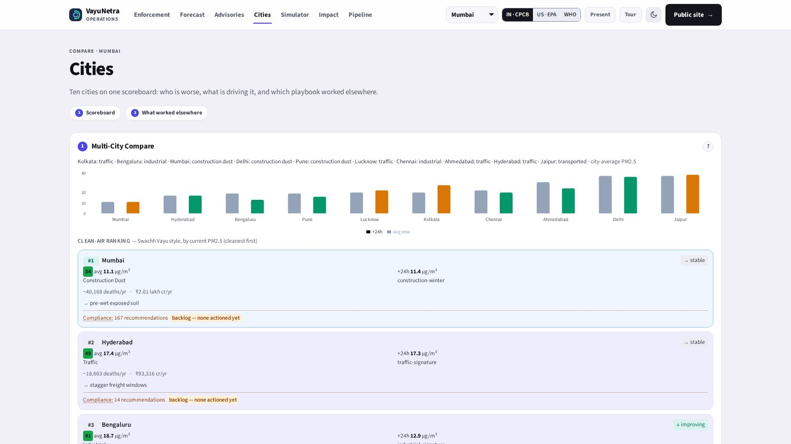

---

## 10. Simulator (section 5)

Steps: **1 Choose an intervention · 2 Run & read the result · 3 Best bundle for a budget.** Pick an intervention (waste-burn ban · halt construction dust · odd-even traffic · industrial shutdown · GRAP Stage III package) and a horizon → **Run simulation**.

The result: ΔAQI (average and best cell), cells affected, confidence, and the cited impact cards — people protected (real population), health cost avoided (₹), deaths averted, CO₂e co-benefit — every figure with its citation. **Honest zero**: if the chosen source barely contributes today the app says so instead of inventing an impact.

**Best bundle for a budget**: set an inspector-hour budget → **Rank packages** → intervention bundles ranked by impact per inspector-hour.

---

## 11. Impact (section 6)

Steps: **1 City ROI · 2 Where the funds should go · 3 Fairness audit.**
- **City ROI** — attributable deaths / yr, annual health burden (₹), what a 30 % NCAP cut would avert, with citations and the VSL caveat.

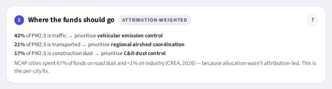

- **Where the funds should go** — live source shares mapped to NCAP spending heads (attribution-led allocation, the answer to CREA's finding that cities put 67 % of funds into road dust).

- **Fairness audit** — enforcement priority correlates with pollution contribution (by design) and people exposed (disclosed); **no socio-economic input exists anywhere in the pipeline**.

---

## 12. Pipeline (section 7)

Steps: **1 Run the agents · 2 Read the trace.** The last multi-agent run as a timeline — Orchestrator → Attribution → Forecast → **Spike gate** → Enforcement → Advisory — with per-node durations. The spike gate is a decision: no spike → straight to advisory; spike → escalated to enforcement (on clean air Enforcement shows *skipped* rather than pretending). **Run agents live** triggers a real end-to-end run against the live database and updates the trace in front of you (0.8–9.7 s of compute).

---

## 13. Under the hood

### 13.1 The five agents and the spike gate (LangGraph)
| Agent | Does |
|---|---|
| A0 Orchestrator | Reads latest signals, finds spiking cells, routes the graph, stamps per-node latency traces |
| A1 Attribution | GBM + SHAP hybrid source attribution per cell; abstains to signature priors below the R² gate |
| A2 Forecast | 24/48/72 h per-cell PM2.5, persistence-blended, CQR-calibrated intervals, calibrated exceedance probabilities |
| Spike gate | Branches: enforcement only when cells spike (PM2.5 > 120 µg/m³ or focus cells exist) |
| A3 Enforcement | Priority = contribution × exposure × actionability × confidence; jurisdiction-aware RAG citations; writes the worklist without touching acted-upon items |
| A4 Advisory | Deterministic multilingual advisories, vulnerability-adjusted per ward/audience |
| A5 Multi-City | Cross-city trends, dominant sources, playbooks, health burden |

Supporting models: E1 satellite source detection (labelled Earth-Engine heuristic; a learned detector is roadmap) · E2 dense 1-km field · E3 counterfactual what-if · E5 optimiser · E7 health ₹ / lives / CO₂e · GRAP forecast trigger · multimodal RAG (text + Sentinel-2 patches).

### 13.2 Data sources (all free / open)
CPCB CAAQMS (via OpenAQ / data.gov.in) · Open-Meteo + ERA5 weather and boundary layer · Sentinel-5P NO₂, Sentinel-2, NASA FIRMS (Earth Engine) · OpenStreetMap sources / facilities / roads · GPW v4.11 population · GTFS + road-network mobility proxy. Ingest and model refresh run on GitHub Actions (hourly + nightly); one row per reading (unique key), raw readings kept 180 days then archived to Storage with a daily rollup kept forever (`docs/SCALE.md`).

### 13.3 API (FastAPI on Render)
**44 HTTP routes + 1 WebSocket**, one envelope. Feeds (`/cities` `/aqi/current` `/history*` `/attribution` `/forecast` `/coverage` `/plume` `/static-layers`…), officer (`/enforcement*`, `/interventions*`, `/brief*`), citizen (`/advisory*`, `/clean-zones`, `/telegram/webhook`, `/ivr/*`, `/report*`), analysis (`/comparison` `/roi` `/simulate` `/optimize` `/latency` `/traces`), metrics (`/metrics/benchmark` `/metrics/attribution` `/metrics/interventions`), `/landing/snapshot`, agents/admin (`/agent/query`, `/admin/cities`, `WS /live`). Full table with roles: `docs/API_CONTRACT.md`. Public reads via anon JWT under RLS; every write server-side with the service role; admin behind `X-Admin-Key`.

### 13.4 Database (Supabase Postgres + PostGIS + pgvector)
`cities, measurements, attribution, forecasts, emission_sources, enforcement_recs, enforcement_status_log, intervention_tracking, advisories, advisory_subscribers, citizen_reports, kb_chunks, action_traces, coverage_field, vulnerability, profiles, pm25_daily_rollup` — 20 migrations in `supabase/migrations/`.

### 13.5 Honesty, by construction
- Attribution **abstains** (R² gate + coverage mask) instead of guessing; how today's split was made is shown in the console.
- The forecast is benchmarked the way a reviewer would (strict temporal split, production-faithful rolling refit, three baselines, shared support mask, regime slices, onset recall, Brier skill) and the numbers — including the Severe-tail weakness — are served by the API and printed in the console.
- Attribution is compared bucket by bucket with published apportionment (TERI-ARAI 2018; Guttikunda 2019, CSTEP 2022) with disagreements stated (`docs/ATTRIBUTION_VALIDATION.md`).
- Real GRAP orders are replayed and a weather-normalised effect check is published, null results included (`docs/OUTCOMES.md`).
- Health text is LLM-free; impact figures return null over invented constants; notices are drafts; nothing fabricated is written to the production database; the audit trail is append-only.
- Where ₹0 stops is measured and published (`docs/SCALE.md`).

### 13.6 Ops
`make dev` · `make test` (284 backend tests, 64 % line coverage, CI gate 55 %) · `cd web && npx playwright test` (7 smoke; `VN_LIVE=1` adds the 9-flow live officer journey) · `web/scripts/qa/*.mjs` (full walkthrough, axe, mobile, city sweep, deck render) · `make prewarm` (GO / NO-GO) · `make benchmark` · GitHub Actions: hourly ingest, nightly models / registry / enforcement / advisories / brief / retention.

---

## 14. Troubleshooting & FAQ

| Symptom | Meaning / fix |
|---|---|
| Amber "backend waking up" notice | Render free-tier cold start; the console shows bundled fixtures meanwhile. **retry** or wait — it clears on the first successful call; the notice never blocks the map controls. `make prewarm` before demos. |
| Map loads, panels empty | Backend still waking, or a city with thin data — switch city once. |
| "No per-cell forecast" in the Cell Story | That cell has no fresh per-cell rows; the city Forecast section still works. |
| Worklist says nothing to enforce | Air is clean (spike gate) or filters exclude everything. |
| Advisory empty in a language | That city does not publish that language (languages come from the city config). |
| Notice PDF takes seconds | Live dossier assembly (RAG + satellite patch) — expected. |
| Tour will not reappear | Once-only by design; replay with **?**. |
| Simulator says "near-zero effect" | Honest result — pick the dominant source. |
| Real or demo? | `/health` shows `DEMO_MODE`; the landing page and console say "as of" and "snapshot" where a fixture is shown. |

**Glossary.** **H3** — Uber's hexagonal grid; res-8 ≈ 1 km². **SHAP** — per-feature contribution of a prediction, in µg/m³. **CQR** — conformalised quantile regression; makes the 80 % band cover ~80 %. **P(>120)** — calibrated probability the cell exceeds Very Poor. **Persistence** — the "tomorrow = today" baseline. **Onset recall** — share of clean→Very-Poor transitions the alarm flags in advance. **GRAP** — Delhi-NCR's Graded Response Action Plan (Stages I–IV). **RAG** — retrieval over the regulation corpus (citations, not free text). **RLS** — Postgres row-level security. **PRANA** — the NCAP reporting portal cities report actions and spend to. **GPW** — Gridded Population of the World v4.11.

---

## 15. Repo map

| Path | What |
|---|---|
| `api/main.py` | All FastAPI routes |
| `agents/` | The six LangGraph agents, the brief, the notice PDF writer |
| `ml/`, `core/` | Models, benchmark and hindsight harnesses, H3 utils, impact and intervention math, city configs, ward lookup |
| `connectors/` | CPCB / OpenAQ, Earth Engine, Open-Meteo, OSM, population, vulnerability, mobility |
| `scripts/` | prewarm, refresh_advisories, archive_measurements, morning brief, fetch_history, doc PDFs |
| `web/src/` | React console + landing (`App.tsx` shell, one panel per card, `console/flows.tsx` = the spines) |
| `web/scripts/qa/` | Playwright QA: full walkthrough (this guide's screenshots), axe, mobile, city sweep, deck render |
| `demo/fixtures/` | The 19 JSON fixtures behind DEMO_MODE |
| `supabase/migrations/` | Schema, RLS, seeds, closure log, one-row-per-reading key, retention rollup (20 migrations) |
| `docs/` | This guide (`guide/` = its screenshots), the finale deck (`VayuNetra_Pitch.html` + static exports, `PITCH_SCRIPT.md`, built from `docs/pitch/`), benchmarks and outcomes, API contract, validation, scale, QA evidence |
| `eval/evaluate.ipynb` | The validation trail, including the documented failures |
